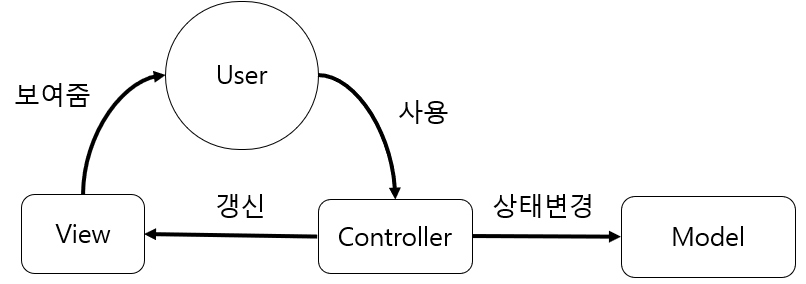

# 나인패치\(9Patch\) 이미지

> ## **나인패치\(9Patch\) 이미지란?** 
>
> #### 이미지가 줄어들거나 늘어날때 이미지의 왜곡을 해결하는 방법


```text
<Button
    android:layout_width="400dp"
    android:layout_height="wrap_content"
    android:background="@drawable/btn_img3"
    android:text="Basic Image" />

<Button
    android:layout_width="400dp"
    android:layout_height="wrap_content"
    android:background="@drawable/btn_img4"
    android:text="9-Patch image" />
```

위의 소스코드는 확연히 늘어난 부분의 두 버튼에 해당하는 소스코드이다. 가로 길이를 400dp로 변경하였는데 일반적인 이미지 늘렸을때 사진1과 같이 깨지는 현상이 발생하지만 9-Patch Image의 경우 늘어났을 때 깨지지 않는 이미지를 확인할 수 있다.


### **나인패치 이미지를 만드는 방법**

나인패치 이미지를 만드는 프로그램은 여러가지가 있겠지만 [Android Asset Studio](http://romannurik.github.io/AndroidAssetStudio/nine-patches.html#&sourceDensity=320&name=example) 에서 만드는 법을 소개하겠다.\(Android Studio에서 9-Patch를 만드는 방법도 있지만 테스트 중 발생한 에러를 해결하지못하여 다음에 소개하겠다.\)



위 사이트에서 변경을 원하는 이미지를 선택하고 \(다운로드\) 버튼을 누르면 된다.

다운로드 된 파일의 res안에 모든 폴를 복사하여 프로젝트 src &gt; app &gt; res 아래에 붙여넣기 해주면 된다. 






