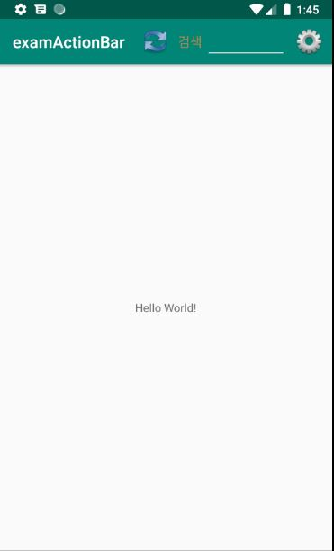

# ActionBar

## 안드로이드의 메뉴 

* **옵션메뉴** 

        **- 기본메뉴로 최대 6개까지 메뉴아이템을 포함 할 수 있으며, 그 이상의 아이템은 More로 표시**

* **컨텍스트 메뉴** 

        **- 화면을 길게 누르면 나타나는 메뉴로 편집 상태를 바꾸거나 할 때 사**

## ActionBar 사용하기 

1\) res 아래에 menu 폴더 생성 후 menu\_main.xml 을 추가한다.

2\) menu\_main.xml 에서 원하는 menu를 추가한다. 


```markup
<?xml version="1.0" encoding="utf-8"?>
<menu xmlns:android="http://schemas.android.com/apk/res/android"
    xmlns:app="http://schemas.android.com/apk/res-auto">
    <item
        android:id="@+id/menu_refresh"
        android:icon="@drawable/menu_refresh"
        android:title="새로고침"
        app:showAsAction="always" />

    <item
        android:id="@+id/menu_search"
        android:icon="@drawable/menu_search"
        android:title="검색"
        app:showAsAction="always" />

    <item
        android:id="@+id/menu_settings"
        android:icon="@drawable/menu_settings"
        android:title="설정"
        app:showAsAction="always" />
</menu>

```


  3\) MainActivity 에서 `onCreateOptionsMenu` 를 재 정의 한다. 


```java
@Override
public boolean onCreateOptionsMenu(Menu menu) {
    getMenuInflater().inflate(R.menu.menu_main,menu);
    return true;
}
```


4\) 각 메뉴의 클릭 이벤트를 확인하기 위해서는 `onOptionsItemSelected` 를 재정의 한다. 


```java
@Override
public boolean onOptionsItemSelected(MenuItem item) {
    int curId = item.getItemId();
    switch (curId){
        case R.id.menu_refresh:
            Toast.makeText(this,"새로고침 메뉴 클릭됨",Toast.LENGTH_LONG).show();
            break;
        case R.id.menu_search:
            Toast.makeText(this,"검색 메뉴 클릭됨",Toast.LENGTH_LONG).show();
            break;
        case R.id.menu_settings:
            Toast.makeText(this,"설정 메뉴 클릭됨",Toast.LENGTH_LONG).show();
            break;
         default:
             break;
    }
    return super.onOptionsItemSelected(item);
}
```



초기에 ActionBar 에 대한 설정은 res &gt; values &gt; style.xml 에 정의 되어있다. 


```markup
<resources>

    <!-- Base application theme. -->
    <style name="AppTheme" parent="Theme.AppCompat.Light.DarkActionBar">
        <!-- Customize your theme here. -->
        <item name="colorPrimary">@color/colorPrimary</item>
        <item name="colorPrimaryDark">@color/colorPrimaryDark</item>
        <item name="colorAccent">@color/colorAccent</item>
    </style>

</resources>
```


DarkActionBar를 NoActionBar로 변경하면 ActionBar가 안보이게 될 것이다. 

MainActivity에서도 ActionBar를 숨기는 것이 가능하다. 


```java
ActionBar actionBar = getSupportActionBar();
actionBar.hide();
```



### ActionBar에 레이아웃 사용하기 

1\) 레이아웃 파일 search\_layout.xml 을 생성한다. 


```markup
<?xml version="1.0" encoding="utf-8"?>
<LinearLayout xmlns:android="http://schemas.android.com/apk/res/android"
    android:layout_width="match_parent"
    android:layout_height="wrap_content"
    android:orientation="horizontal">

    <TextView
        android:layout_width="wrap_content"
        android:layout_height="wrap_content"
        android:text="검색"
        android:textColor="#ffad8745"
        android:textSize="16dp" />

    <EditText
        android:id="@+id/edt_1"
        android:layout_width="100dp"
        android:layout_height="wrap_content"
        android:layout_marginLeft="4dp" />
</LinearLayout>
```


2\) menu\_main.xml 에 showAsAction에 withText를 추가하고 actionLayout을 설정한다. 

```text
<item
    android:id="@+id/menu_search"
    android:icon="@drawable/menu_search"
    android:title="검색"
    app:showAsAction="always|withText"
    app:actionLayout="@layout/search_layout"/>
```



참고로 액션바의 디스플레이 옵션 상수는 다음과 같다. 

| **디스플레이 옵션상수** | **설명** |
| :--- | :--- |
| DISPLAY\_USE\_LOGO | 홈 아이콘 부분에 로고 아이콘을 사용합니다. |
| DISPLAY\_SHOW\_HOME | 홈 아이콘을 표시하도록 합니다.  |
| DISPLAY\_HOME\_AS\_UP | 홈 아이콘에 뒤로가기 모양의 &lt; 아이콘을 같이 표시합니다. |
| DISPLAY\_SHOW\_TITLE | 타이틀을 표시하도록 합니다.  |

### actionlayout의 view에 접근하는방법 

```text
LinearLayout linearLayout = (LinearLayout) menu.findItem(R.id.action_sort_type).getActionView();
ImageButton btnAnimation = linearLayout.findViewById(R.id.imgbtn_sort_type);
```

### Fragment안에서 Menu 숨기는방법 

```java
@Override
public void onPrepareOptionsMenu(Menu menu) {
    MenuItem item=menu.findItem(R.id.action_sort_type);
    if(item!=null)
        item.setVisible(false);
}
```

```java
@Nullable
@Override
public View onCreateView(...){
    setHasOptionsMenu(true);
}
```










