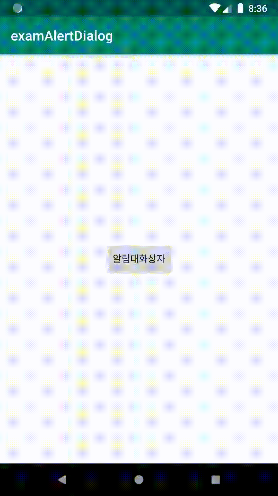

# Alert Dialog

**AlertDialog를 사용하는 방법**

AlertDialog는 안내메세지를 대화상자 형태로 나타내준다. 



```java
AlertDialog.Builder builder = new AlertDialog.Builder(this);
builder.setTitle("안내");
builder.setMessage("종료하시겠습니까?");
builder.setIcon(android.R.drawable.ic_dialog_alert);
builder.setPositiveButton("예", new DialogInterface.OnClickListener() {
    @Override
    public void onClick(DialogInterface dialog, int which) {
        Toast.makeText(getApplicationContext(),"예 버튼이 눌렸습니다.",Toast.LENGTH_LONG).show();
    }
});
builder.setNegativeButton("아니오", new DialogInterface.OnClickListener() {
    @Override
    public void onClick(DialogInterface dialog, int which) {
        Toast.makeText(getApplicationContext(),"아니오 버튼이 눌렸습니다.",Toast.LENGTH_LONG).show();
    }
});

AlertDialog dialog = builder.create();
dialog.show();
```



다음과 같은 속성으로 AlertDialog의 형태를 변경할 수 있다.

| AlertDialog.Builder 속성 | 설명 |
| :--- | :--- |
| setTitle | 제목 |
| setIcon | 제목옆 아이콘 |
| setMessage | 안내메세지 |
| setPositiveButton | 확인버튼 |
| setNagativeButton | 취소버튼 |
| setItems | 목록리스트  |
| setView | 사용자 지정 레이아웃을 원할때 사용  |
| create | 생성  |








