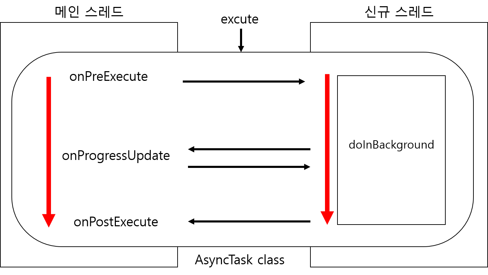

# AsyncTask




1\) onPreExecute

* AsyncTask 가 excute되면 호출

2\) onProgressUpdata

* doInBackground 메소드 안에서 publishProgress 메소드 호출 시 자동호출

3\) onPostExcute

* onInBackground의 작업이 완료되면 호출 



```java
public class MainActivity extends AppCompatActivity {
    ProgressBar progressTest;
    Button btnStartProgressTest;

    @Override
    protected void onCreate(Bundle savedInstanceState) {
        super.onCreate(savedInstanceState);
        setContentView(R.layout.activity_main);
        progressTest = findViewById(R.id.progress_test);
        btnStartProgressTest = findViewById(R.id.btn_start_progress_test);
        btnStartProgressTest.setOnClickListener(new View.OnClickListener() {
            @Override
            public void onClick(View v) {
                ProgressTask task = new ProgressTask();
                task.execute("시작");
            }
        });
    }

    class ProgressTask extends AsyncTask<String, Integer, Integer> {
        int value = 0;

        @Override
        protected Integer doInBackground(String... strings) {
            while (true) {
                if (value > 100) {
                    break;
                }
                value += 1;

                publishProgress(value);
                try {
                    Thread.sleep(200);
                } catch (InterruptedException e) {
                    e.printStackTrace();
                }
            }
            return value;
        }

        @Override
        protected void onProgressUpdate(Integer... values) {
            super.onProgressUpdate(values);
            progressTest.setProgress(values[0].intValue());
        }

        @Override
        protected void onPostExecute(Integer integer) {
            super.onPostExecute(integer);
            Toast.makeText(getApplicationContext(), "완료됨", Toast.LENGTH_LONG).show();
        }
    }
}
```










