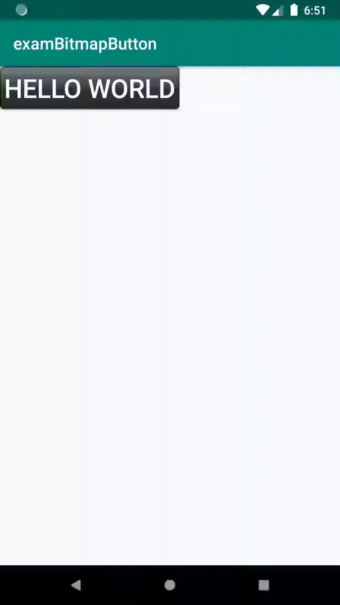

# Bitmap Button

1. AppCompatButton을 상속한 클래스를 생성하고 생성자를 구현한다.



```java
public class BitmapButton extends AppCompatButton {
    //생성자
    public BitmapButton(Context context) {
        super(context);
        init(context);
    }
    //생성    
    public BitmapButton(Context context, AttributeSet attrs) {
        super(context, attrs);
        init(context);
    }
}

```



```markup
<?xml version="1.0" encoding="utf-8"?>
<resources>
    <dimen name="text_size">12dp</dimen>
</resources>

```



  2. 생성자에 원하는 속성\(배경이미지, 텍스트 크기, 텍스트 색 등\)을 설정한다.



```java

    private void init(Context context) {
        //초기 배경이미지 설정 
        setBackgroundResource(R.drawable.title_bitmap_button_normal);
        //dimes 리소스에 지정하여 사용 
        float textSize = getResources().getDimension(R.dimen.text_size);
        //버튼 텍스트 사이즈 설정 
        setTextSize(textSize);
        //버튼 텍스트 색상 설
        setTextColor(Color.WHITE);
    }

    
```



  3. 원하는 이벤트의 메소드를 재 정의 하고 변경사항이 있을경우 invalidate\(\)를 호출하여 다시 그려준다.



```java
@Override
    public boolean onTouchEvent(MotionEvent event) {
        int action = event.getAction();

        switch (action) {
            case MotionEvent.ACTION_DOWN: //버튼이 눌렸을 때 
                setBackgroundResource(R.drawable.title_bitmap_button_clicked);
                break;
            case MotionEvent.ACTION_UP: // 버튼이 눌린상태에서 떼졌을 때
                setBackgroundResource(R.drawable.title_bitmap_button_normal);
                break;
        }
        //이미지를 다시 그린다.
        invalidate();
        return true;
    }
```



  4. ****사용자 정의 클래스를 사용하기 위해서는 layout 파일에 패키지명.클래스명를 태그로 사용하면 된다.    ex\) com.example.exambitmapbutton.BitmapButton



```markup
 <com.example.exambitmapbutton.BitmapButton
        android:layout_width="wrap_content"
        android:layout_height="wrap_content"
        android:text="Hello World"/>
```





