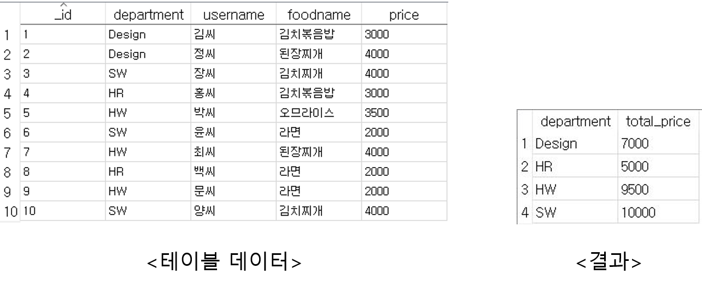

# DataBase, INSERT, SELECT

## 데이터 저장하기 \( INSERT \)

```text
INSERT INTO 테이블명 (칼럼명1, 칼럼명2, ...) VALUES(값1, 값2, ...)
```

```text
db.execSQL("insert into employee(name, age, phone) values ('John', 20, '010-7788-1234'" );
```

```text
String sql =
        "insert into employee" +
                "(" +
                "id, " +
                "name, " +
                "age, " +
                "phone, " +
                ") " +
                "values(?, ?, ?, ?)";

Object[] params = {id, name, age, phone};
database.execSQL(sql, params);
```

## 데이터 조회하기 \( SELECT \)

### 전체 데이터 조회 

```text
SELECT * FROM employee
```

### 특정 컬럼 조회

```text
//컬럼 하나 조회
SELECT name FROM employee
//컬럼 여러개 조회 
SELECT name, age FROM employee
```

### 조건 조회 \( WHERE \)

```text
//조건 하나로 조회
SELECT * FROM employee WHERE age > 24
//조건 여러개 모두 성립되는 레코 조회 
SELECT * FROM employee WHERE age > 24 AND age < 29 
//조건 여러개 중 성립되는 레코드 조회 
SELECT * FROM employee WHERE age < 24 or age > 29
```

### 중복 제거 조회 \( DISTINCT \)

```text
SELECT DISTINCT name, age, phone FROM employee 
```

```text
SELECT name, age, phone FROM employee GROUP BY name
```

GROUP BY 를 사용하여 중복 제거 조회도 가능하다. 

### 그룹별 조회 \( GROUP BY \)

```text
SELECT department, SUM(price) as total_price FROM receipt GROUP BY department
```

다음 사진은 쿼리문 실행 결과를 나타낸다. 

부서별로 먹은 음식의 가격을 합산한 결과이다.




SUM\(price\) as total\_price ... GROUP BY department

price 컬럼을 GROUP BY 로 설정된 department 컬럼으로 합계를 구하여 total\_price라고 정한다.

* SUM\( \) : 합계 
* AVG\( \) : 평균 
* COUNT\( \) : 개수 
* MIN\( \) : 최소 값 
* MAX\( \) : 최대 값  


### 그룹별 조건 조회 \( GROUP BY ... HAVING \)

WHERE절에서는 집계함수를 사용할 수 없기 때문에 HAVING 절을 사용하여 조건비교를 한다. 그러므로 HAVING 절은 GROUP BY와 함께 쓰인다. 

```text
SELECT department, SUM(price) as total_price 
FROM receipt 
GROUP BY department 
HAVING department != 'HR'
```

위의 쿼리문은 HR 부서만 제외하고 식비를 부서별로 계산한 내역이다. 

### 정렬 조회 \( ORDER BY \) 

ORDER BY 기준컬럼 DESC : 내림차순 정렬 

ORDER BY 기준컬럼 ASC : 오름차순 정렬 




