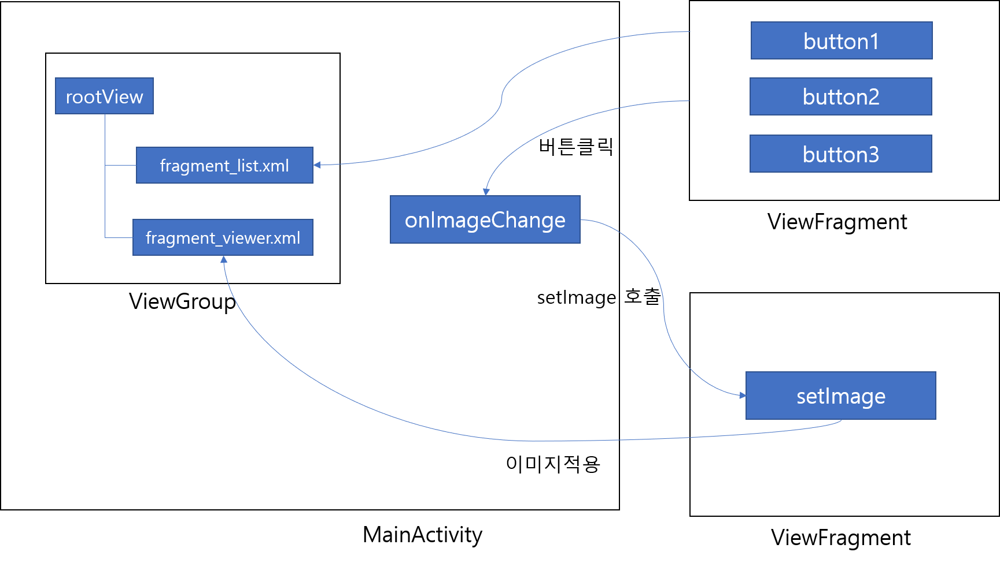
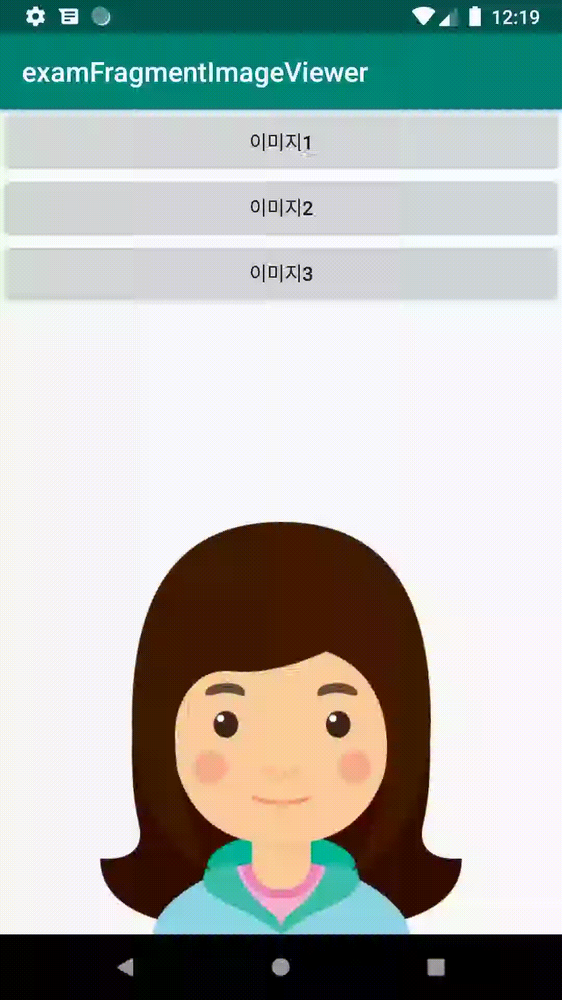

# Fragment Image Viewer

## 프래그먼트로 이미지뷰어 만들기 

#### 버튼을 클릭하여 이미지를 변경하는 예제를 해보자. 

#### **1\) 버튼리스트를 Fragment로 정의 한다.**

**2\) 이미지뷰어를 Fragment로 정의한다.**

**3\) ListFragment에서 ViewGroup과 fragment\_list를 inflate한다.** 

**4\) ViewerFragment에서 ViewGroup과 fragment\_viewer를 inflate 한다.** 

**5\) ListFragment에서 onAttach를 재 정의하고 MainActivity를 가져온다.**

**6\) ListFragment에서 각 버튼 클릭시 MainActivity의 onImageChange를 호출한다.** 

**7\) MainActivity의 onImageChange는 ViewerFragment를 호출한다.** 

**8\) activity\_main.xml에 ListFragment, ViewerFragment를 추가한다.** 

**9\) MainActivity에 FragmentManager를 사용하여 ListFragment, ViewFragment를 정의한다.** 

**10\) View의 setImage를 호출하여 이미지를 설정한다.** 





```markup
<?xml version="1.0" encoding="utf-8"?>
<LinearLayout xmlns:android="http://schemas.android.com/apk/res/android"
    xmlns:tools="http://schemas.android.com/tools"
    android:layout_width="match_parent"
    android:layout_height="match_parent"
    android:orientation="vertical">

    <fragment
        android:id="@+id/listFragment"
        android:name="com.example.examfragmentimageviewer.ListFragment"
        android:layout_width="match_parent"
        android:layout_height="0dp"
        android:layout_weight="1" />

    <fragment
        android:id="@+id/viewerFragment"
        android:name="com.example.examfragmentimageviewer.ViewerFragment"
        android:layout_width="match_parent"
        android:layout_height="0dp"
        android:layout_weight="1" />
</LinearLayout>
```



```java
public class MainActivity extends AppCompatActivity {

    ListFragment listFragment;
    ViewerFragment viewerFragment;

    FragmentManager manager;

    @Override
    protected void onCreate(Bundle savedInstanceState) {
        super.onCreate(savedInstanceState);
        setContentView(R.layout.activity_main);

        listFragment = new ListFragment();
        viewerFragment = new ViewerFragment();

        manager = getSupportFragmentManager();

        listFragment = (ListFragment) manager.findFragmentById(R.id.listFragment);
        viewerFragment = (ViewerFragment) manager.findFragmentById(R.id.viewerFragment);
    }

    public void onImageChange(int index) {
        viewerFragment.setImage(index);
    }
}
```





```markup
<?xml version="1.0" encoding="utf-8"?>
<LinearLayout xmlns:android="http://schemas.android.com/apk/res/android"
    android:layout_width="match_parent"
    android:layout_height="match_parent">
    <ImageView
        android:id="@+id/img_1"
        android:layout_width="match_parent"
        android:layout_height="wrap_content"
        android:src="@drawable/iu"/>

</LinearLayout>
```



```java
public class ViewerFragment extends Fragment {

    ImageView Img;
    @Nullable
    @Override
    public View onCreateView(@NonNull LayoutInflater inflater, @Nullable ViewGroup container, @Nullable Bundle savedInstanceState) {

        ViewGroup rootView = (ViewGroup) inflater.inflate(R.layout.fragment_viewer,container,false);

        Img = rootView.findViewById(R.id.img_1);
        return rootView;
    }

    public void setImage(int index){
        if(index == 0){
            Img.setImageResource(R.drawable.iu);
        }else if(index == 1){
            Img.setImageResource(R.drawable.jang);
        }else if(index == 2){
            Img.setImageResource(R.drawable.lee);
        }
    }
}

```





```markup
<?xml version="1.0" encoding="utf-8"?>
<LinearLayout xmlns:android="http://schemas.android.com/apk/res/android"
    android:layout_width="match_parent"
    android:layout_height="match_parent"
    android:orientation="vertical">

    <Button
        android:id="@+id/btn_image1"
        android:layout_width="match_parent"
        android:layout_height="wrap_content"
        android:text="이미지1"/>

    <Button
        android:id="@+id/btn_image2"
        android:layout_width="match_parent"
        android:layout_height="wrap_content"
        android:text="이미지2"/>

    <Button
        android:id="@+id/btn_image3"
        android:layout_width="match_parent"
        android:layout_height="wrap_content"
        android:text="이미지3"/>

</LinearLayout>
```



```java
public class ListFragment extends Fragment {

    MainActivity activity;
    @Override
    public void onAttach(Context context) {
        super.onAttach(context);
        activity = (MainActivity) getActivity();
    }

    @Nullable
    @Override
    public View onCreateView(@NonNull LayoutInflater inflater, @Nullable ViewGroup container, @Nullable Bundle savedInstanceState) {

        ViewGroup rootView = (ViewGroup) inflater.inflate(R.layout.fragment_list,container,false);

        Button btnImage1 = rootView.findViewById(R.id.btn_image1);
        btnImage1.setOnClickListener(new View.OnClickListener() {
            @Override
            public void onClick(View v) {
                activity.onImageChange(0);
            }
        });
        Button btnImage2 = rootView.findViewById(R.id.btn_image2);
        btnImage2.setOnClickListener(new View.OnClickListener() {
            @Override
            public void onClick(View v) {
                activity.onImageChange(1);
            }
        });
        Button btnImage3 = rootView.findViewById(R.id.btn_image3);
        btnImage3.setOnClickListener(new View.OnClickListener() {
            @Override
            public void onClick(View v) {
                activity.onImageChange(2);
            }
        });
        return rootView;
    }
}

```








