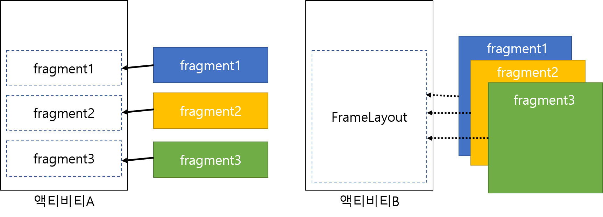
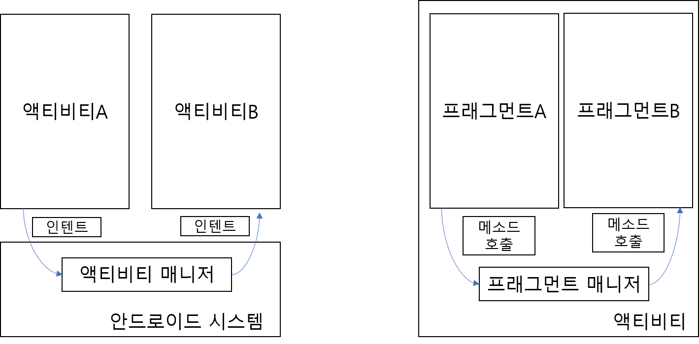
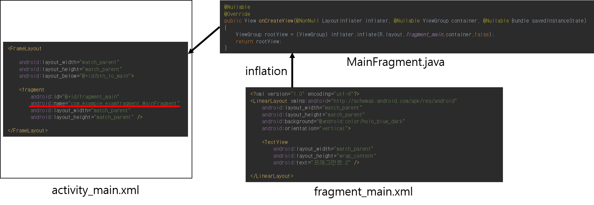
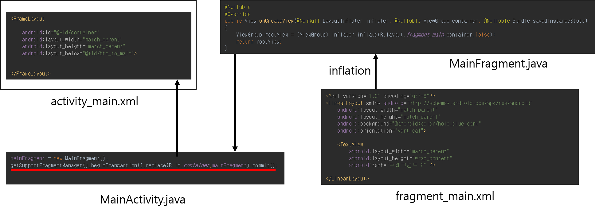
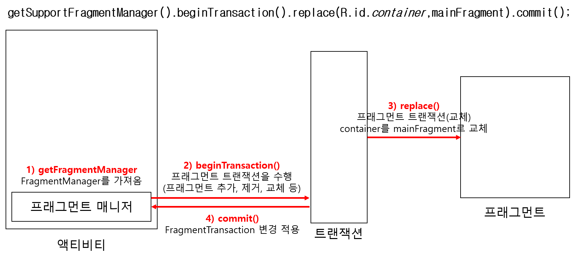

# Fragment

## 프래그먼트\(Fragment\)란? 

하나의 액티비티 안에 여러개의 부분화면을 만들기 위해 사용하는 방법 



### 특징

* 여러 개의 프래그먼트를 하나의 액티비티에 조합 가능
* 자체 수명주기 \(액티비티 내에 포함되어 있어야 하며 해당 프래그먼트의 수명주기는 호스트 액티비티의 수명주기에 직접적으로 영향을 받음 \)
* 자체 입력이벤트 
* 액티비티 실행 중에 추가 및 제거가 가능한 액티비티의 모듈식 섹션
* \(예시\) 액티비티 일시정지 -&gt; 프래그먼트 일시정지, 액티비티 소멸 -&gt; 모든 프래그먼트 소멸 
* 프래그먼트 트랜잭션을 수행할 때에 액티비티가 관리하는 백 스택에도 추가 가능 
* 그러므로 Back버튼으로 프래그먼트 트랜잭션을 거꾸로 돌릴 수 있음 
* 액티비티의 일부로 추가하는 경우, 액티비티의 뷰 계층 내부의 ViewGroup안에 존재하며 해당 프래그먼트가 자신의 뷰레이아웃을 정의 
* 액티비티 레이아웃에서 &lt;fragment&gt;를 사용하거나 기존 ViewGroup에 추가\(java\) 
* UI가 없는 보이지않은 형태로도 사용가능

  스마트폰은 화면전환이 필요하지만 태블릿의 경우 화면이 크기 때문에 화면전환보다 하나의 화면에 다 보여야함 

프래그먼트를 사용하여 독립적으로 동작하도록 만든다면 쉽게 구현이 가능하다.



## 프래그먼트 생성 및 추가 

### **사용자 인터페이스 추가 \(&lt;fragment&gt;\)**



### **사용자 인터페이스 추가 \(java\)**





## 프래그먼트 트랜잭션 수행 

commit\(\)이전의 addToBackStack\(null\) 을 통해 이전상태\(예시에서 교체 트랜잭션\)를 백 스택에 보존한다.

사용자가 Back 버튼을 누름으로써 트랜잭션을 되돌리고 이전 프래그먼트를 다시 가져올 수 있다. 

```java
// Create new fragment and transaction
Fragment newFragment = new ExampleFragment();
FragmentTransaction transaction = getFragmentManager().beginTransaction();

// Replace whatever is in the fragment_container view with this fragment,
// and add the transaction to the back stack
transaction.replace(R.id.fragment_container, newFragment);
transaction.addToBackStack(null);

// Commit the transaction
transaction.commit();
```

## 프래그먼트 생명주기 

## 




