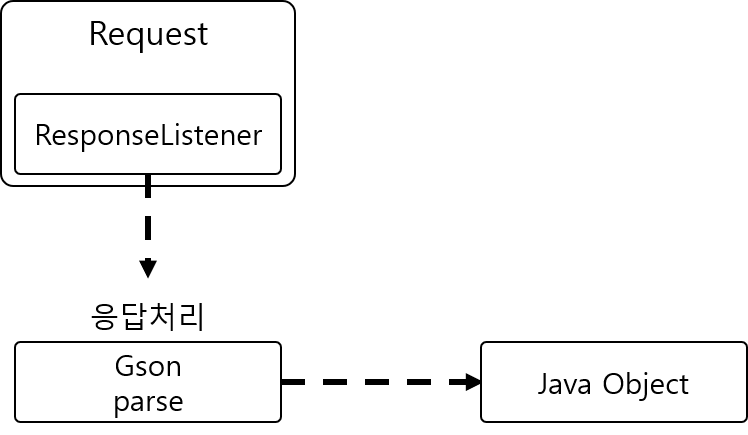

# Gson

## Gson

**JSON 문자열을 객체로 변환해주는 라이브러리** 

Volley를 이용해 웹서버로부터 JSON 응답을 받았다면 Gson을 이용해 자바객체로 바꾸고 사



### 라이브러리 참조



```text
implementation 'com.google.code.gson:gson:2.8.2'
```



### JSON 문자열의 속성에 맞는 자바 클래스 정의 

* JSON의 문자열에서 속성이 배열인경우 ArrayList 자료형으로 사용 



```java
public class MovieList {
    MovieListResult boxOfficeResult = new MovieListResult();
}
```



```java
public class MovieListResult {
    public String boxofficeType;
    public String showRange;
    public ArrayList<Movie> dailyBoxOfficeList = new ArrayList<>();
}
```



```java
public class Movie {
    String rnum;
    String rank;
    String rankInten;
    String rankOldAndNew;
    String movieCd;
    String movieNm;
    String openDt;
    String salesAmt;
    String salesShare;
    String salesInten;
    String salesChange;
    String salesAcc;
    String audiCnt;
    String audiInten;
    String audiChange;
    String audiAcc;
    String scrnCnt;
    String showCnt;
}
```



### Gson으로 변환 및 사용 

```java
Gson gson = new Gson();
MovieList movieList = gson.fromJson(response, MovieList.class);
```

```java
public class MainActivity extends AppCompatActivity {
    TextView txtMovieResponse;
    Button btnMovieList;
    @Override
    protected void onCreate(Bundle savedInstanceState) {
        super.onCreate(savedInstanceState);
        setContentView(R.layout.activity_main);

        txtMovieResponse = findViewById(R.id.txt_movie_response);
        btnMovieList = findViewById(R.id.btn_movie_list);
        btnMovieList.setOnClickListener(new View.OnClickListener() {
            @Override
            public void onClick(View v) {
                requestMovieList();
            }
        });

        if (AppHelper.requestQueue == null) {
            AppHelper.requestQueue = Volley.newRequestQueue(getApplicationContext());
        }
    }

    private void requestMovieList() {
        String url = "http://www.kobis.or.kr/kobisopenapi/webservice/rest/boxoffice/searchDailyBoxOfficeList.json?key=430156241533f1d058c603178cc3ca0e&targetDt=20120101";
        StringRequest request = new StringRequest(
                Request.Method.GET,
                url,
                new Response.Listener<String>() {
                    @Override
                    public void onResponse(String response) {
                        println("응답 받음 -> " + response);
                        processResponse(response);
                    }
                },
                new Response.ErrorListener() {
                    @Override
                    public void onErrorResponse(VolleyError error) {
                        println("에러 발생 -> " + error.getMessage());
                    }
                }
        );
        request.setShouldCache(false);
        AppHelper.requestQueue.add(request);
        println("영화목록 요청 보냄.");
    }

    public void processResponse(String response) {
        Gson gson = new Gson();

            MovieList movieList = gson.fromJson(response, MovieList.class);
            if(movieList != null){
                int countMovie = movieList.boxOfficeResult.dailyBoxOfficeList.size();
                println("박스오피스 타입 : " + movieList.boxOfficeResult.boxofficeType);
                println("응답받은 영화 개수 : " + countMovie);
            }
    }

    public void println(String data) {
        txtMovieResponse.append(data + "\n");
    }
}
```





