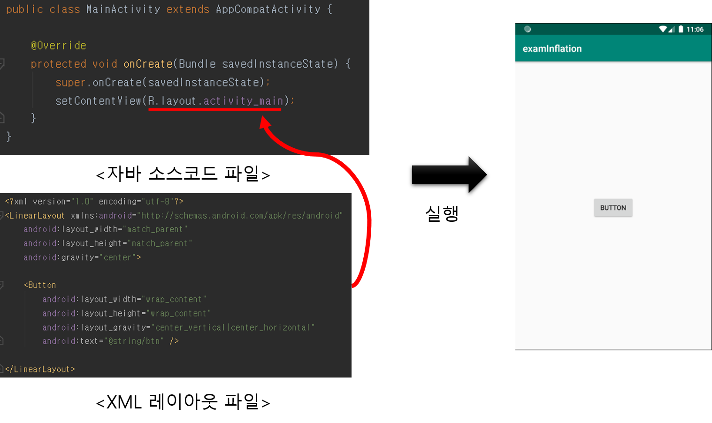
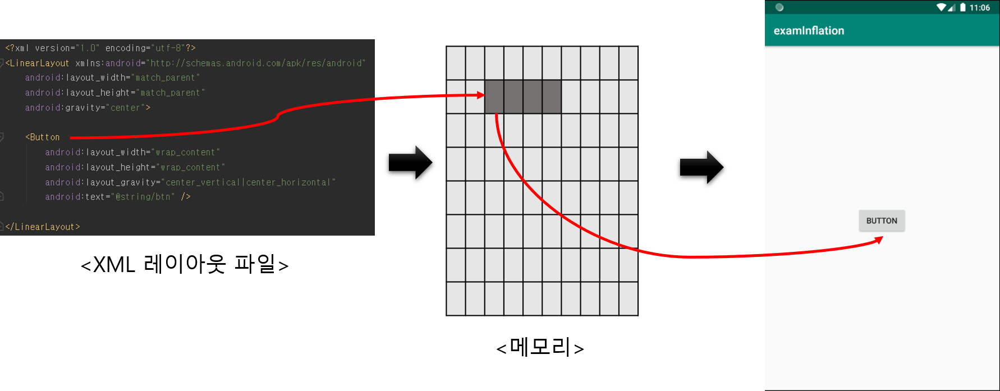

# Inflation

#### 우선 하나의 Activity가 어떻게 실행될 수 있는지 떠올려보자.

### XML 레이아웃 파일과 자바소스파일 매칭 

* XML 레이아웃과 자바소스코드 파일이 하나의 액티비티를 생성한다
* setContentView\(R.layout.xml파일\) 메소드를 사용하여 레이아웃을 연결시킨다. 



## 인플레이션\(Inflation\)이란?

XML레이아웃에는 버튼이 태그형식되어있고  버튼을 사용하기위해서는 메모리에 객체화 되어있어야 하는데 이 과정은 안드로이드 시스템이 담당한다. 이 과정을 레이아웃 인플레이터가 처리해주며 레이아웃인플레이션이라고 한다. 즉, **XML 레이아웃에 정의 된 내용이 메모리에 객체화 되는 과정**을 뜻한다. 



## LayoutInflation을 사용한 부분화면 예제 

자바파일에서 부분화면을 구현해보자.



```java
public class MainActivity extends AppCompatActivity {

    FrameLayout container;
    LayoutInflater layoutInflater;
    @Override
    protected void onCreate(Bundle savedInstanceState) {
        super.onCreate(savedInstanceState);
        setContentView(R.layout.activity_main);

        container = findViewById(R.id.container);
        Button btnShow = (Button) findViewById(R.id.btnShow);
        btnShow.setOnClickListener(new View.OnClickListener() {
            @Override
            public void onClick(View v) {
                layoutInflater = (LayoutInflater)getSystemService(Context.LAYOUT_INFLATER_SERVICE);
                layoutInflater.inflate(R.layout.sub1,container,true);
            }
        });
        Button btnHide = (Button) findViewById(R.id.btnHide);
        btnHide.setOnClickListener(new View.OnClickListener() {
            @Override
            public void onClick(View v) {
                container.removeAllViews();
            }
        });
    }
}
```



```markup
<?xml version="1.0" encoding="utf-8"?>
<LinearLayout xmlns:android="http://schemas.android.com/apk/res/android"
    android:layout_width="match_parent"
    android:layout_height="match_parent"
    android:orientation="vertical">

    <Button
        android:id="@+id/btn1"
        android:layout_width="wrap_content"
        android:layout_height="wrap_content"
        android:layout_marginTop="20dp"
        android:layout_marginLeft="20dp"
        android:text="@string/btn" />

    <FrameLayout
        android:id="@+id/container"
        android:layout_width="match_parent"
        android:layout_height="300dp">

    </FrameLayout>
</LinearLayout>
```



```markup
<?xml version="1.0" encoding="utf-8"?>
<LinearLayout xmlns:android="http://schemas.android.com/apk/res/android"
    android:layout_width="match_parent"
    android:layout_height="match_parent"
    android:background="@android:color/holo_blue_dark">

    <TextView
        android:layout_width="wrap_content"
        android:layout_height="wrap_content"
        android:text="부분화면"/>

    <Button
        android:layout_width="wrap_content"
        android:layout_height="wrap_content" />

    <ImageView
        android:layout_width="wrap_content"
        android:layout_height="wrap_content"
        android:background="@mipmap/ic_launcher" />

</LinearLayout>
```



1. 우선 부분화면을 구현하기 위해서는 FrameLayout을 사용하고 id를 설정해준다.
2. findViewById 메소드로 FrameLayout의  id값에 해당하는 View를 가져온다.\(container\)
3. getSystemService\(\)를 통해 인스턴스화 된 서비스를 LayoutInflater의 객체\(layoutInflater\)로 받는다.

```text
layoutInflater = (LayoutInflater)getSystemService(Context.LAYOUT_INFLATER_SERVICE);
```

```text
layoutInflater = getLayoutInflater();
```

```text
layoutInflater = LayoutInflater.from(getApplicationContext());
```

getSystemService\(Context.LAYOUT\_INFLATER\_SERVICE\)대신 getIayoutInflater\(\), LayoutInflator.form\(getApplicationContext\(\)\) 으로 가능하다.

   4. layoutInflater는 inflate 메소드를 통해 지정된 layout을 FrameLayout의 자식뷰 적용시킨다. 

   5. 버튼클릭을 통해 부분화면을 추가 및 삭제 되는것을 확인할 수 있다.


[getSystemService\(\)](https://developer.android.com/reference/android/content/Context.html#getSystemService%28java.lang.String%29) 는 원하는 서비스를 불러오는 메소드이다.

공식문서의 getSystemService\(\) 설명에서 서비스의 종류를 확인할 수 있다.








