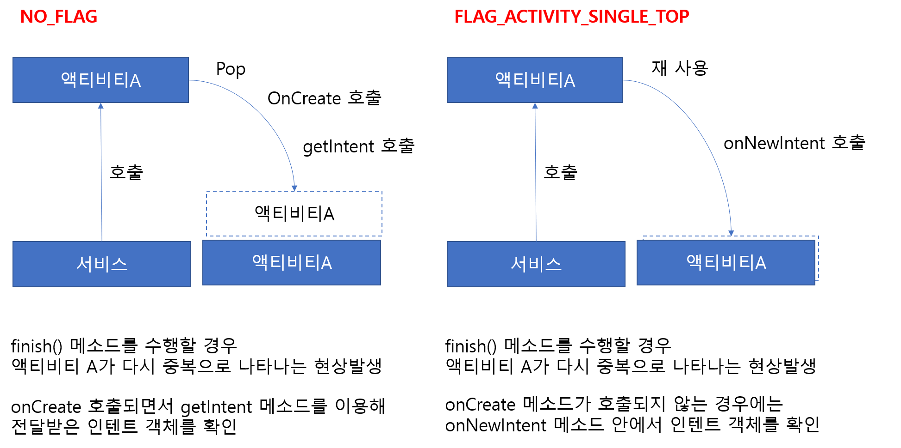

# Intent

## Intent란?

일반적으로 **액티비티 시작 , 서비스 시작 , 브로드 캐스트 사이에서의 전달** 역할을 한다.  

### 액션과 데이터를 사용하는 대표적인 예

<table>
  <thead>
    <tr>
      <th style="text-align:left">&#xC18D;&#xC131;</th>
      <th style="text-align:left">&#xC124;&#xBA85;</th>
    </tr>
  </thead>
  <tbody>
    <tr>
      <td style="text-align:left">ACTION_DIAL tel:01012341234</td>
      <td style="text-align:left">&#xC9C0;&#xC815;&#xB41C; &#xC804;&#xD654;&#xBC88;&#xD638;&#xB97C; &#xC774;&#xC6A9;&#xD574;
        &#xC804;&#xD654;&#xAC78;&#xAE30; &#xD654;&#xBA74;&#xC744; &#xBCF4;&#xC5EC;&#xC90C;</td>
    </tr>
    <tr>
      <td style="text-align:left">ACTION_VIEW tel:01012341234</td>
      <td style="text-align:left">
        <p>&#xC9C0;&#xC815;&#xB41C; &#xC804;&#xD654;&#xBC88;&#xD638;&#xB97C; &#xC774;&#xC6A9;&#xD574;
          &#xC804;&#xD654;&#xAC78;&#xAE30; &#xD654;&#xBA74;&#xC744; &#xBCF4;&#xC5EC;&#xC90C;</p>
        <p>URI &#xAC12;&#xC758; &#xC720;&#xD615;&#xC5D0; &#xB530;&#xB77C; VIEW &#xC561;&#xC158;&#xC774;
          &#xB2E4;&#xB978; &#xAE30;&#xB2A5;&#xC744; &#xC218;&#xD589;&#xD568;</p>
      </td>
    </tr>
    <tr>
      <td style="text-align:left">ACTION_EDIT content://contacts/people/2</td>
      <td style="text-align:left">&#xC804;&#xD654;&#xBC88;&#xD638; &#xB370;&#xC774;&#xD130;&#xBCA0;&#xC774;&#xC2A4;
        &#xC815;&#xBCF4;&#xC911;&#xC5D0; ID&#xAC12;&#xC774; 2&#xC778; &#xC815;&#xBCF4;&#xB97C;
        &#xD3B8;&#xC9D1;&#xD558;&#xAE30;&#xC704;&#xD55C; &#xD654;&#xBA74;&#xC744;
        &#xBCF4;&#xC5EC;&#xC90C;</td>
    </tr>
    <tr>
      <td style="text-align:left">ACTION_VIEW content://contacts/people</td>
      <td style="text-align:left">&#xC804;&#xD654;&#xBC88;&#xD638;&#xBD80; &#xB370;&#xC774;&#xD130;&#xBCA0;&#xC774;&#xC2A4;
        &#xB0B4;&#xC6A9;&#xC744; &#xBCF4;&#xC5EC;&#xC90C;</td>
    </tr>
  </tbody>
</table>### 명시적인텐트와 암시적 인텐트 

* **명시적 인텐트 : 앱 내의 특정 액티비티나 서비스 등 특정한 앱 구성 요소를 시작하기 위해 사용하는 인텐트이다.** 
* **암시적 인텐트 : 작업을 지정하여 기기에서 해당 작업을 수행할 수 있는 모든 앱을 호출할 수 있도록 한다.** 

#### 명시적인텐트 예시 

```java
Intent intent2 = new Intent();
ComponentName name = new ComponentName("com.example.examintent","com.example.examintent.MenuActivity");
intent2.setComponent(name);
startActivity(intent2);
```

#### 암시적인텐트 예시 

```java
String receiver = etMoblie.getText().toString();
Intent intent = new Intent(Intent.ACTION_VIEW, Uri.parse("tel:"+receiver));
startActivity(intent);
```


### 인텐트의 대표적 속성 

* **범주\(Category\)** : 액션이 실행되는 데 필요한 추가적인 정보를 제공  
* **타입\(Type\)** : 인텐트에 들어가는 데이터의 MIME 타입을 명시적으로 지정 
* **컴포넌트\(Component\)** : 인텐트에 사용될 컴포넌트 클래스 이름을 명시적으로 지정 
* **부가데이터\(Extra\)** : 인텐트는 추가적인 정보를 넣을 수 있도록 번들\(Bundle\) 객체를 담고 있고 이 객체를 통해 인텐트 안에 더 많은 정보를 넣어 다른 애플리케이션 구성요소에 전달할 수 있음 


### 액티비티를 위한 플래그




액티비티를 위한 다양한 플래그를 확인하기위해서는 다음 가이드 문서를 확인하자

[Android Developer : Intent](https://developer.android.com/reference/android/content/Intent.html?hl=ko#FLAG_ACTIVITY_SINGLE_TOP)







