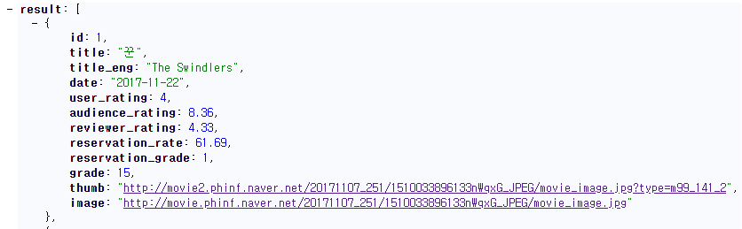
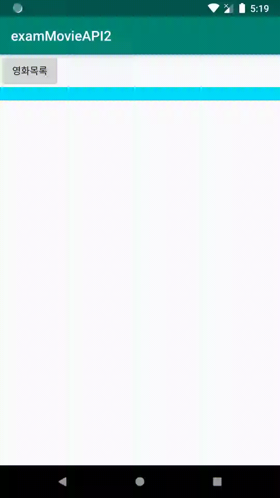

# JSON

## JSON\(JavaScript Object Notation\)

 속성-값 쌍\( attribute–value pairs and array data types \(or any other serializable value\)\) 또는 "키-값 쌍"으로 이루어진 데이터 오브젝트를 전달하기 위해 인간이 읽을 수 있는 텍스트를 사용하는 개방형 표준 포맷

* 속성과 속성이름은 콜론\( : \) 으로 구분 
* 콜론\( : \) 뒤에는 문자열, 숫자, 객체 
* 객체인경우 { } 중괄호 , 배열인경우 \[ \] 대괄호 사용 
* 대괄호 안에 중괄호로 감싼 객체들이 콤마\( , \) 로 구성 




크롬 브라우저에서 JSONView와 같은 확장프로그램\(Extension\)을 설치하면 깔끔하게 보임 


## JSON 요청

```java
 private void requestMovieList() {
        String url = "http://" + AppHelper.host + ":" + AppHelper.port + "/movie/readMovieList";
        url += "?" + "type=1";
        StringRequest request = new StringRequest(
                Request.Method.GET,
                url,
                new Response.Listener<String>() {
                    @Override
                    public void onResponse(String response) {
                        println("응답 받음 -> " + response);
                    }
                },
                new Response.ErrorListener() {
                    @Override
                    public void onErrorResponse(VolleyError error) {
                        println("에러 발생 -> " + error.getMessage());
                    }
                }
        );
        request.setShouldCache(false);
        AppHelper.requestQueue.add(request);
        println("영화목록 요청 보냄.");
    }
```






