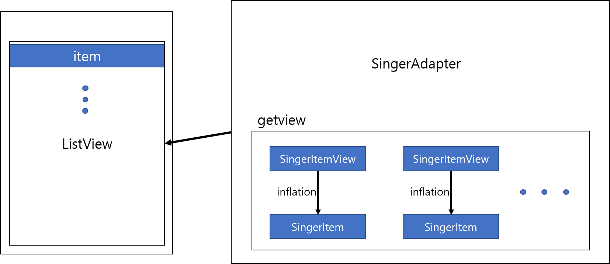
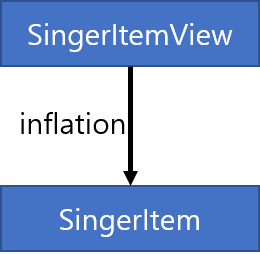

# ListView



위의 그림은 참고하여 아래의 절차에 따라 리스트뷰를 이해해보자.

## 1\) 아이템을 위한 XML 레이아웃을 정의

우선 리스트뷰는 일반적으로 동일한 레이아웃을 사용하므로 반복적으로 사용할 아이템의 레이아웃을 정의해야한다. 아래의 코드는 아래의 사진\(아이템 레이아웃\)과 같이 이미지, 이름, 전화번호로 구성된다. 각 속성들은 아이템을 위한 뷰정의할 때 사용되므로 잘 기억해 두어야한다. 




```markup
<?xml version="1.0" encoding="utf-8"?>
<LinearLayout xmlns:android="http://schemas.android.com/apk/res/android"
    android:layout_width="match_parent"
    android:layout_height="match_parent"
    android:orientation="horizontal">

    <ImageView
        android:layout_width="80dp"
        android:layout_height="80dp"
        android:src="@mipmap/ic_launcher" />

    <LinearLayout
        android:layout_width="match_parent"
        android:layout_height="wrap_content"
        android:layout_marginLeft="10dp"
        android:orientation="vertical">

        <TextView
            android:id="@+id/tvName"
            android:layout_width="wrap_content"
            android:layout_height="wrap_content"
            android:text="이름"
            android:textColor="@color/colorPrimaryDark"
            android:textSize="30dp" />

        <TextView
            android:id="@+id/tvMobile"
            android:layout_width="wrap_content"
            android:layout_height="wrap_content"
            android:text="전화번호"
            android:layout_marginTop="8dp"
            android:textColor="@color/colorPrimaryDark"
            android:textSize="24dp" />
    </LinearLayout>
</LinearLayout>
```




## 2\) 아이템을 위한 뷰 정의

리스트뷰에 들어갈 각 아이템은 하나의 뷰로 정의되어야 한다. 또한 이 뷰는 여러개의 뷰를 담고 있는 뷰 그룹이어야 한다. 그러므로 인플레이션을 통해 뷰 계층구조가 만들어져야 한다.




인플레이션에 대한 정보는 다음 페이지를 참고하자.




```java
public class SingerItemView extends LinearLayout {

    TextView tvName;
    TextView tvMobile;
    ImageView imgPhoto;

    public SingerItemView(Context context) {
        super(context);
        init(context);
    }

    public SingerItemView(Context context, @Nullable AttributeSet attrs) {
        super(context, attrs);
        init(context);
    }

    private  void init(Context context){
        LayoutInflater inflater = (LayoutInflater)context.getSystemService(Context.LAYOUT_INFLATER_SERVICE);
        inflater.inflate(R.layout.singer_item,this,true);

        tvName = (TextView) findViewById(R.id.tvName);
        tvMobile = (TextView) findViewById(R.id.tvMobile);
        imgPhoto = (ImageView) findViewById(R.id.imgPhoto);
    }
    public void setTvName(String name){
        tvName.setText(name);
    }

    public void setTvMobile(String mobile){
        tvMobile.setText(mobile);
    }

    public void setImgPhoto(int resId ) {
        imgPhoto.setImageResource(resId);
    }
}
```


## 3\) 어댑터 정의

리스트뷰의 데이터 관리를 위해서는 어댑터가 필요하다. 각 아이템을 속성들을 설정하기 위해서는 getView 메소드를 사용한다. 다음 예제에서는 name, mobile 속을 설정하고 있다. getView를 통해 반환된 view 값은 리스트뷰에서 setAdapter로 각 아이템을 표시할 때 적용된다.



```java
 class SingerAdapter extends BaseAdapter{
        ArrayList<SingerItem> items = new ArrayList<SingerItem>();

        @Override
        public int getCount() {
            return items.size();
        }

        public void addItem(SingerItem item){
            items.add(item);
        }
        @Override
        public Object getItem(int position) {
            return items.get(position);
        }

        @Override
        public long getItemId(int position) {
            return position;
        }

        @Override
        public View getView(int position, View convertView, ViewGroup parent) {
            SingerItemView view = new SingerItemView(getApplicationContext());
            if(convertView == null){
                view = new SingerItemView(getApplicationContext());
            }else{
                view = (SingerItemView) convertView;
            }
            SingerItem item = items.get(position);
            view.setTvName(item.getName());
            view.setTvMobile(item.getMobile());
            return view;
        }
    }
```



```java
public class SingerItem {
    String name;
    String mobile;
    int photoResId;

    public SingerItem(String name, String mobile, int photoResId){
        this.name = name;
        this.mobile = mobile;
        this.photoResId = photoResId;
    }
    public String getName(){
        return name;
    }

    public String getMobile() {
        return mobile;
    }

    public int getPhotoResId() {
        return photoResId;
    }

    public void setPhotoResId(int photoResId) {
        this.photoResId = photoResId;
    }

    public void setName(String name) {
        this.name = name;
    }

    public void setMobile(String mobile) {
        this.mobile = mobile;
    }

    @Override
    public String toString() {
        return "SingerItem{" +
                "name='" + name + '\'' +
                ", mobile='" + mobile + '\'' +
                '}';
    }
}
```



## 4\) 리스트뷰 정의

리스트뷰를 선언하고 어댑터를 연결하여 리스트뷰의 아이템을 표현할 수 있다.

또한 리스트뷰의 각 아이템의 클릭이벤트 및 아이템 추가 및 제거도 가능하다. 

다음 예제는 아이템 클릭시 이름값을 토스트 메세지로 띄우고 아이템을 추가하는 소스코드이다.



```java
    ListView listView = findViewById(R.id.listView);

    adapter = new SingerAdapter();
    adapter.addItem(new SingerItem("장범준","010-1234-1234",R.drawable.jang));
    adapter.addItem(new SingerItem("이적","010-1234-1234",R.drawable.lee));
    adapter.addItem(new SingerItem("아이유","010-1234-1234",R.drawable.iu));
    listView.setAdapter(adapter);

    listView.setOnItemClickListener(new AdapterView.OnItemClickListener() {
        @Override
        public void onItemClick(AdapterView<?> parent, View view, int position, long id) {
            SingerItem item = (SingerItem) adapter.getItem(position);
            Toast.makeText(getApplicationContext(),item.name,Toast.LENGTH_LONG).show();
        }
    });

    btnAddItem = (Button) findViewById(R.id.btnAddItem);
    etName = (EditText)findViewById(R.id.etName);
    etMobile = (EditText)findViewById(R.id.etMobile);

    btnAddItem.setOnClickListener(new View.OnClickListener() {
        @Override
        public void onClick(View v) {
            String name = etName.getText().toString();
            String mobile = etMobile.getText().toString();

            adapter.addItem(new SingerItem(name,mobile,R.drawable.jang));
            //갱신
            adapter.notifyDataSetChanged();
 
       }
    });
}
```




아이템을 추가한 후 adapter.notifyDataSetChanged\(\); 를 사용해야만 리스트뷰가 갱신이 된다.





Icons made by [Freepik](https://www.flaticon.com/authors/freepik) from [www.flaticon.com](https://www.flaticon.com/) is licensed by [CC 3.0 BY](http://creativecommons.org/licenses/by/3.0/)


