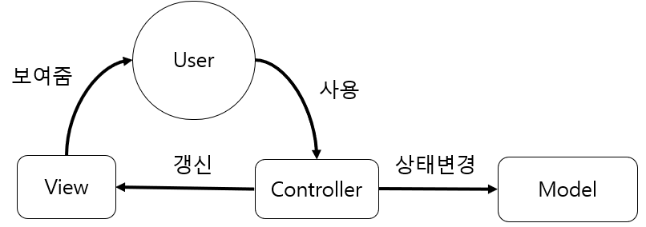

# MVC, MVP, MVVM

## MVC

## MVC

> Model :  데이터, 상태, 비즈니스로직 
>
> View : Model의 표현
>
> Controller :  Model의 상태를 변경, View의 Model의 표시방법 변경

> Model :  데이터, 상태, 비즈니스로직 
>
> View : Model의 표현
>
> Controller :  Model의 상태를 변경, View의 Model의 표시방법 변경

## MVP

> Model : 
>
> View :
>
> Presenter :

## MVVM

> Model : 
>
> View : 
>
> ViewModel :



