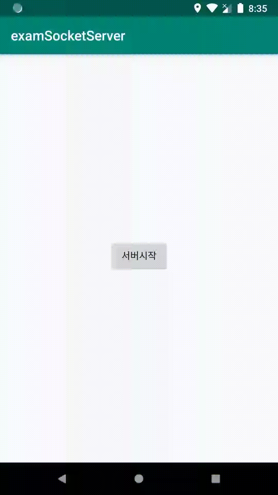

# Socket

## 네트워킹 

### 원격지의 서버를 연결하는 방식 

* 2-tier C/S 모델 
* 3-tier 모델 


### 네트워크 사용시 주의할 점 

* 네트워킹을 사용할 때는 **반드시 스레드** 사용 \(최신버전 안드로이드에서는 스레드 사용 필수\)
* 스레드를 사용하므로 UI업데이트를 위해서는 **반드시 핸들러** 사용 


## 표준 자바의 소켓 클라이언트 

1\) 소켓 연결을 위한 Socket 객체 생성 

2\) 데이터를 쓰기 위한 스트림 객체를 만들고 데이터 쓰기 

3\) 데이터를 읽기 위한 스트림 객체를 만들고 데이터 읽기 

### 서버 생성 

1\) `ServerSocket` 클래스의 객체를 생성하고 `port`를 지정한다.

2\) `Socket` 클래스의 객체를 생성하고 `accept()` 로 클라이언트의 접속을 기다린다. 

3\) `getInputStream()`로 초기화 한 `ObjectInputStream` 의 객체를 통해  `readObject()` 로 데이터를 가져온다. 

4\) `getOutputStream()`로 초기화 한 `ObjectOutputStream` 의 객체를 통해  `writeObject()` 로 데이터를 전달한다.

5\) 통신이 종료되었으므로 소켓을 종료한다. 



```java
class ServerThread extends Thread {
    public void run() {
        int port = 5002;
        try {
            ServerSocket server = new ServerSocket(port);
            Log.d("ServerThread", "서버가 실행됨");

            while (true) {
                Socket socket = server.accept();
                ObjectInputStream inputStream = new ObjectInputStream(socket.getInputStream());
                Object input = inputStream.readObject();
                Log.d("ServerThread", "input : " + input);

                ObjectOutputStream outputStream = new ObjectOutputStream(socket.getOutputStream());
                outputStream.writeObject(input + "from server");
                outputStream.flush();
                Log.d("ServerThread","output 보냄");

                socket.close();
            }
        } catch (IOException e) {
            e.printStackTrace();
        } catch (ClassNotFoundException e) {
            e.printStackTrace();
        }

    }

}
```



### 서버 시작 



```java
ServerThread thread = new ServerThread();
thread.start();
```



### 클라이언트 생성

1\) `Socket` 클래스의 객체를 생성하고  host 주소와 port 번호로 서버에 접속을 한다. 

2\) `getOutputStream()`로 초기화 한 `ObjectOutputStream` 의 객체를 통해  `writeObject()` 로 데이터를 전달한다.

3\) `getInputStream()`로 초기화 한 `ObjectInputStream` 의 객체를 통해  `readObject()` 로 데이터를 가져온다. 

4\) 받은 데이터는 `handler`를 사용하여 UI 의 정보 변경한다. 



```java
 class ClientThread extends Thread{
        public void run(){
            String host = "localhost";
            int port = 5002;
            try {
                Socket socket = new Socket(host,port);

                ObjectOutputStream outputStream = new ObjectOutputStream(socket.getOutputStream());
                outputStream.writeObject("안녕!");
                outputStream.flush();
                Log.d("ClientThread","서버로 보냄");

                ObjectInputStream inputStream = new ObjectInputStream(socket.getInputStream());
                Object input = inputStream.readObject();
                Log.d("ClientThread","받은 데이터 :"+input);
                
                handler.post(new Runnable() {
                    @Override
                    public void run() {
                        txtReceiveData.setText("받은 데이터 : "+ input);
                    }
                });
                
            } catch (IOException e) {
                e.printStackTrace();
            } catch (ClassNotFoundException e) {
                e.printStackTrace();
            }
        }
    }
```



### 클라이언트 시작 



```java
ClientThread clientThread = new ClientThread();
clientThread.start();
```



### 권한 부여 

```text
<uses-permission android:name="android.permission.INTERNET" />
```

## 죽지않는 서비스로 서버 시작 

### 서비스 구현 

서비스에서 서버시작을 하여 앱이 종료되었을때에도 서버가 종료되지 않도록 한다. 



```java
public class ChatService extends Service {
    @Override
    public IBinder onBind(Intent intent) {
        return null;
    }

    @Override
    public void onCreate() {
        super.onCreate();
        StartForeground();
        ServerThread thread = new ServerThread();
        thread.start();
    }


    @Override
    public int onStartCommand(Intent intent, int flags, int startId) {
        return super.onStartCommand(intent, flags, startId);
    }

    @Override
    public void onDestroy() {
        super.onDestroy();
    }

    private void StartForeground() {
        NotificationCompat.Builder builder;
        if (Build.VERSION.SDK_INT >= Build.VERSION_CODES.O) {
            builder = new NotificationCompat.Builder(this, "channel_id");
        } else {
            builder = new NotificationCompat.Builder(this);
        }
        builder.setSmallIcon(R.drawable.ic_launcher_foreground);
        builder.setContentText("Socket Server 가 실행 중 입니다.");
        if (Build.VERSION.SDK_INT >= Build.VERSION_CODES.O) {
            NotificationManager notificationManager = (NotificationManager) getSystemService(Context.NOTIFICATION_SERVICE);
            notificationManager.createNotificationChannel(new NotificationChannel("channel_id", "ch foreground", NotificationManager.IMPORTANCE_LOW));
        }
        startForeground(1, builder.build());
    }

}
```



### 서비스 등록 



```markup
<service android:name=".ChatService" />
```



### 서비스 시작 



```java
Intent intent = new Intent(getApplicationContext(),ChatService.class);
if(Build.VERSION.SDK_INT >= Build.VERSION_CODES.O ){
    startForegroundService(intent);
}else{
    startService(intent);
}
```




안드로이드 Oreo 버전 이상에서는 백그라운드를 허용하지 않기 때문에 `startForgroundService(intent)`로 서비스를시작하고 push 알림을 띄우는`startForeground(1,builder.build())`를 사용하여 죽지 않는 서비스를 구현해야 한다. 







