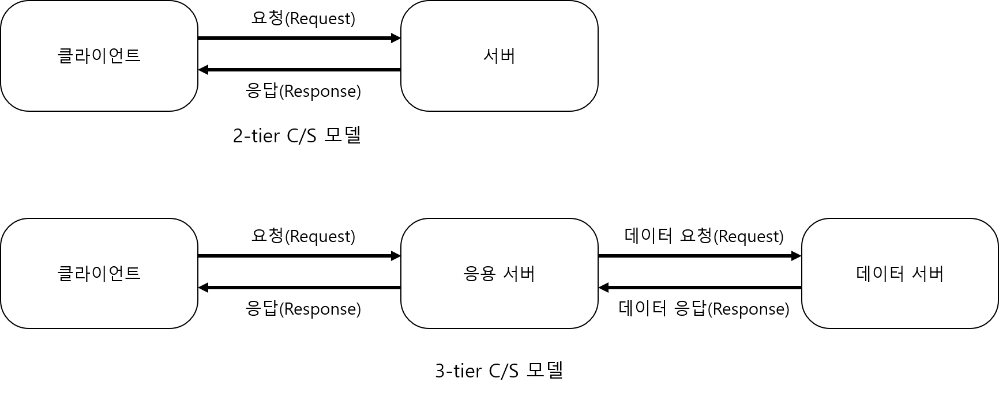
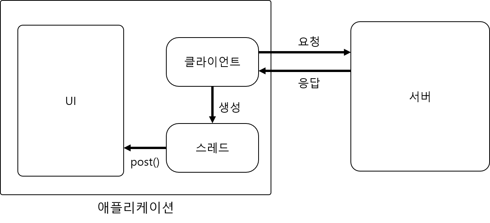

# Socket

## 네트워킹 

### 원격지의 서버를 연결하는 방식 

* 2-tier C/S 모델 
* 3-tier 모델 



### 네트워크 사용시 주의할 점 

* 네트워킹을 사용할 때는 **반드시 스레드** 사용 \(최신버전 안드로이드에서는 스레드 사용 필수\)
* 스레드를 사용하므로 UI업데이트를 위해서는 **반드시 핸들러** 사용 



## 표준 자바의 소켓 클라이언트 

1\) 소켓 연결을 위한 Socket 객체 생성 

2\) 데이터를 쓰기 위한 스트림 객체를 만들고 데이터 쓰기 

3\) 데이터를 읽기 위한 스트림 객체를 만들고 데이터 읽기 

### 서버 생성 



```java
class ServerThread extends Thread {
    public void run() {
        int port = 5001;
        try {
            ServerSocket server = new ServerSocket(port);
            Log.d("ServerThread", "서버가 실행됨");

            while (true) {
                Socket socket = server.accept();
                ObjectInputStream inputStream = new ObjectInputStream(socket.getInputStream());
                Object input = inputStream.readObject();
                Log.d("ServerThread", "input : " + input);

                ObjectOutputStream outputStream = new ObjectOutputStream(socket.getOutputStream());
                outputStream.writeObject(input + "from server");
                outputStream.flush();
                Log.d("ServerThread","output 보냄");

                socket.close();
            }
        } catch (IOException e) {
            e.printStackTrace();
        } catch (ClassNotFoundException e) {
            e.printStackTrace();
        }

    }

}
```



### 서버 시작 



```java
ServerThread thread = new ServerThread();
thread.start();
```



### 클라이언트 생성



```java
 class ClientThread extends Thread{
        public void run(){
            String host = "localhost";
            int port = 5001;
            try {
                Socket socket = new Socket(host,port);

                ObjectOutputStream outputStream = new ObjectOutputStream(socket.getOutputStream());
                outputStream.writeObject("안녕!");
                outputStream.flush();
                Log.d("ClientThread","서버로 보냄");

                ObjectInputStream inputStream = new ObjectInputStream(socket.getInputStream());
                Object input = inputStream.readObject();
                Log.d("ClientThread","받은 데이터 :"+input);
            } catch (IOException e) {
                e.printStackTrace();
            } catch (ClassNotFoundException e) {
                e.printStackTrace();
            }
        }
    }
```



### 클라이언트 시작 



```java
ClientThread clientThread = new ClientThread();
clientThread.start();
```







