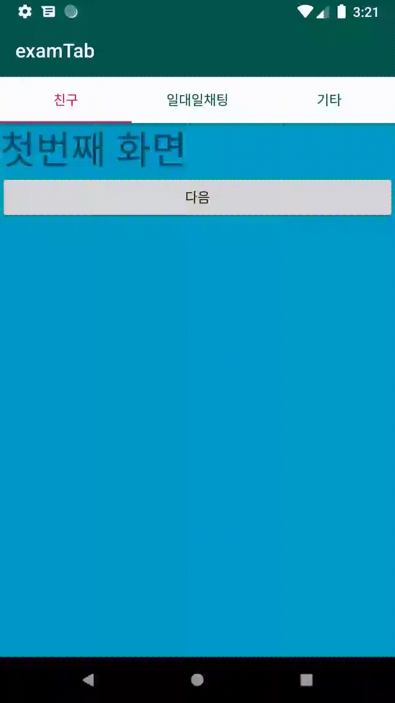

# Tab

### 1\) design 패키지 참조  

File &gt; Project Structure &gt; Dependencies &gt; + Library Dependency &gt; com.android.support:design 추가 

### **2\) activity\_main.xml 파일을 수정한다.** 


```markup
<?xml version="1.0" encoding="utf-8"?>
<RelativeLayout xmlns:android="http://schemas.android.com/apk/res/android"
    xmlns:app="http://schemas.android.com/apk/res-auto"
    android:layout_width="match_parent"
    android:layout_height="match_parent">

    <android.support.design.widget.CoordinatorLayout
        android:layout_width="match_parent"
        android:layout_height="match_parent">

        <android.support.design.widget.AppBarLayout
            android:layout_width="match_parent"
            android:layout_height="wrap_content"
            android:theme="@style/ThemeOverlay.AppCompat.Dark.ActionBar">

            <android.support.v7.widget.Toolbar
                android:id="@+id/toolbar"
                android:layout_width="match_parent"
                android:layout_height="wrap_content"
                android:background="@color/colorPrimaryDark"
                android:elevation="1dp"
                android:theme="@style/ThemeOverlay.AppCompat.Dark">

            </android.support.v7.widget.Toolbar>

            <TableLayout
                android:layout_width="match_parent"
                android:layout_height="wrap_content"
                android:background="@android:color/background_light"
                android:elevation="1dp"
                android:tabGravity="fill"
                android:tabMode="fixed"
                android:tabSelectedTextColor="@color/colorAccent"
                android:tabTextColor="@color/colorPrimaryDark">

            </TableLayout>
        </android.support.design.widget.AppBarLayout>

        <FrameLayout
            android:id="@+id/container"
            android:layout_width="match_parent"
            android:layout_height="match_parent"
            app:layout_behavior="android.support.design.widget.AppBarLayout$ScrollingViewBehavior">

        </FrameLayout>
    </android.support.design.widget.CoordinatorLayout>

</RelativeLayout>
```


**레이아웃 구조**

```text
<CoordinatorLayout>
   <AppBarLayout>
      <Toolbar>
      </Toolbar>
      <TabLayout>
      </TabLayout>
   </AppBarLayout>
   <FrameLayout>
   </FrameLayout>
</CoordinatorLayout>
```


tab과 fragment의 내용이 겹치지 않기 위해서는 다음코드를 추가해야한다. 

```text
app:layout_behavior="android.support.design.widget.AppBarLayout$ScrollingViewBehavior"
```


### 3\) NoActionBar로 style 변경

```text
<style name="AppTheme" parent="Theme.AppCompat.Light.NoActionBar">
```

설정을 안할 경우 다음과 같은 에러가 발생한다. \(링크 참조\)



### **4\) 탭에서 사용할 fragment 파일을 생성한다.**



```java
public class FirstFragment extends Fragment {
    @Nullable
    @Override
    public View onCreateView(@NonNull LayoutInflater inflater, @Nullable ViewGroup container, @Nullable Bundle savedInstanceState) {
        ViewGroup rootView = (ViewGroup) inflater.inflate(R.layout.fragment_first,container,false);
        return rootView;
    }
}
```



```markup
<?xml version="1.0" encoding="utf-8"?>
<LinearLayout xmlns:android="http://schemas.android.com/apk/res/android"
    android:layout_width="match_parent"
    android:layout_height="match_parent"
    android:orientation="vertical"
    android:background="@android:color/holo_blue_dark">

    <TextView
        android:id="@+id/textView"
        android:layout_width="match_parent"
        android:layout_height="wrap_content"
        android:text="첫번째 화면"
        android:textSize="40dp" />

    <Button
        android:id="@+id/btn_next"
        android:layout_width="match_parent"
        android:layout_height="wrap_content"
        android:text="다음"/>
</LinearLayout>
```



### 5\) MainActivity에 탭에 사용할 fragment를 선언한다. 


```java
public class MainActivity extends AppCompatActivity {

    FirstFragment firstFragment;
    SecondFragment secondFragment;
    ThirdFragment thirdFragment;

    @Override
    protected void onCreate(Bundle savedInstanceState) {
        super.onCreate(savedInstanceState);
        setContentView(R.layout.activity_main);

        Toolbar toolbar = findViewById(R.id.toolbar);
        setSupportActionBar(toolbar);
        firstFragment = new FirstFragment();
        secondFragment = new SecondFragment();
        thirdFragment = new ThirdFragment();

        getSupportFragmentManager().beginTransaction().add(R.id.container,firstFragment).commit();
    
    }

```


### 6\) MainActivity의 onCreate 안에 TabLayout에 대한 설정을 한다. 


```java
TabLayout tabs = findViewById(R.id.tabs);
tabs.addTab(tabs.newTab().setText("친구"));
tabs.addTab(tabs.newTab().setText("일대일채팅"));
tabs.addTab(tabs.newTab().setText("기타"));

tabs.setOnTabSelectedListener(new TabLayout.OnTabSelectedListener() {
    @Override
    public void onTabSelected(TabLayout.Tab tab) {
        int position = tab.getPosition();
        Fragment selected = null;
        if(position == 0){
            selected = firstFragment;
        }else if(position == 1){
            selected = secondFragment;
        }else if(position == 2){
            selected = thirdFragment;
        }
        getSupportFragmentManager().beginTransaction().replace(R.id.container,selected).commit();
    }

    @Override
    public void onTabUnselected(TabLayout.Tab tab) {

    }

    @Override
    public void onTabReselected(TabLayout.Tab tab) {

    }
});
```







