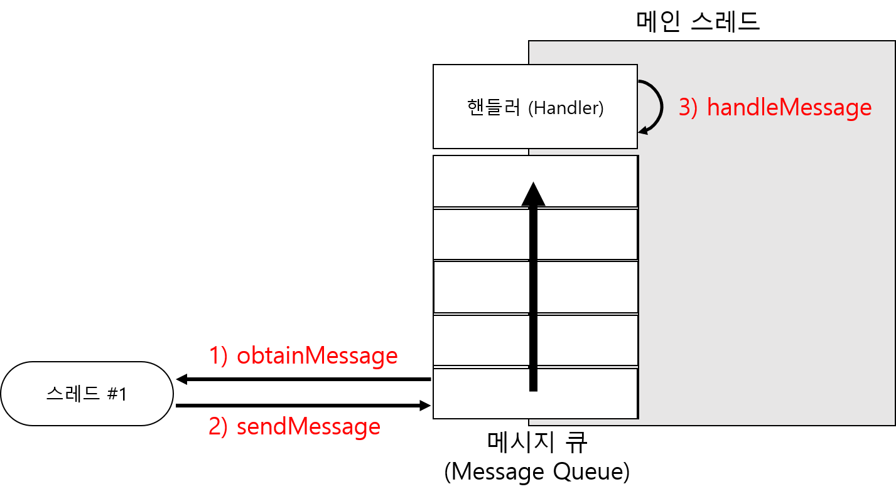

# Thread

## 멀티스레드 


## 표준 자바에서 스레드 사용 방법 

예시 

```java
running = true;
Thread thread1 = new BackgroundThread();
thread1.start();

class BackgroundThread extends Thread{
    public void run(){
        while(running){
            try{
                Thread.sleep(1000);
                value++;
            }catch(InterruptedExceoption ex){
                Log.e("SampleJavaThread","Exception in Thread.",ex);
            }
        }
    }
}
```

## 스레드를 사용한 카운팅 



```java
public class MainActivity extends AppCompatActivity {
    TextView txtThreadValue;
    Button btnStartThread;
    Button btnConfirmThreadValue;

    @Override
    protected void onCreate(Bundle savedInstanceState) {
        super.onCreate(savedInstanceState);
        setContentView(R.layout.activity_main);

        txtThreadValue = findViewById(R.id.txt_thread_value);
        btnStartThread = findViewById(R.id.btn_start_thread);
        btnStartThread.setOnClickListener(new View.OnClickListener() {
            @Override
            public void onClick(View v) {
                BackgroundThread thread = new BackgroundThread();
                thread.start();
            }
        });
        btnConfirmThreadValue = findViewById(R.id.btn_confirm_thread_value);
        btnConfirmThreadValue.setOnClickListener(new View.OnClickListener() {
            @Override
            public void onClick(View v) {
            }
        });
    }

    class BackgroundThread extends Thread {
        int value = 0;
        boolean running = false;

        public void run() {
            running = true;
            while (running) {
                value++;
                txtThreadValue.setText("현재 값 : " + value);
                try {
                    Thread.sleep(1000);
                } catch (InterruptedException e) {
                    e.printStackTrace();
                }
            }
        }
    }
}
```




다음과 같이 메인스레드가 아닌 스레드에서 UI를 변경할 경우 에러가 발생해야 한다. 

부스트코스 강의에서는 Only the original thread that created a view hierarchy can touch its views.라는 메세지로 메인스레드에서만 변경을 해야해서 핸들러를 사용하여 해결을 한다.

하지만 내가 실습을 통해 확인해보았을때 새로 만든 스레드에서도 정상적으로 동작한다. 

왜 그런걸까?


## 핸들러 사용하기

### 1. Message 사용 



### 1\) obtainMessage\(\)

* 메세지 객체 리턴 

### 2\) sendMessage\(\)

* 메세지큐에 넣음 

### 3\) handleMessage\(\)

* 메소드에 정의된 기능이 수행됨 
* 코드가 수행되는 위치는 새로 만든 스레드가 아닌 메인스레드에서 수행됨 



```java
public class MainActivity extends AppCompatActivity {
    TextView txtThreadValue;
    Button btnStartThread;
    Button btnConfirmThreadValue;

    int value = 0;

    ValueHandler handler = new ValueHandler();
    @Override
    protected void onCreate(Bundle savedInstanceState) {
        super.onCreate(savedInstanceState);
        setContentView(R.layout.activity_main);

        txtThreadValue = findViewById(R.id.txt_thread_value);
        btnStartThread = findViewById(R.id.btn_start_thread);
        btnStartThread.setOnClickListener(new View.OnClickListener() {
            @Override
            public void onClick(View v) {
                BackgroundThread thread = new BackgroundThread();
                thread.start();
            }
        });
        btnConfirmThreadValue = findViewById(R.id.btn_confirm_thread_value);
        btnConfirmThreadValue.setOnClickListener(new View.OnClickListener() {
            @Override
            public void onClick(View v) {
            }
        });
    }

    class BackgroundThread extends Thread {
        boolean running = false;

        public void run() {
            running = true;
            while (running) {
                value++;
//                txtThreadValue.setText("현재 값 : " + value);
                Message message = handler.obtainMessage();
                Bundle bundle = new Bundle();
                bundle.putInt("value",value);
                message.setData(bundle);
                handler.sendMessage(message);
                try {
                    Thread.sleep(1000);
                } catch (InterruptedException e) {
                    e.printStackTrace();
                    Log.e("SampleJavaThread", "Exception in Thread.", e);
                }
            }
        }
    }
    class ValueHandler extends Handler {
        @Override
        public void handleMessage(Message msg) {
            super.handleMessage(msg);

            Bundle bundle = msg.getData();
            int value = bundle.getInt("value");
            txtThreadValue.setText("현재 값 : " + value);
        }
    }
}
```



위의 코드와 같이 

1\) 새로만든 스레드\(BackgroundThread\)에서 obtainMessage로 메세지객체를 리턴 받는다. 

2\) Bundle에 담긴 정보를 Message 에 설정하고 메세지큐를 통해 핸들러로 보낸다. 

3\) handler가 호출되면 자동으로 handleMessage가 호출되고 변경 작업을 수행한다. 

  

### 2. Post 메소드 사용 

handler의 Message를 이용한 방법보다 간단하게 사용하는 방법이 있다. 

Post 메소드를 사용하는 방식인데 Thread를 Runnable 방식으로 사용을 하여 작업을 수행 할 수 있다. 

```java
public class MainActivity extends AppCompatActivity {
    TextView txtThreadValue;
    Button btnStartThread;
    Button btnConfirmThreadValue;

    Handler handler2 = new Handler();

    @Override
    protected void onCreate(Bundle savedInstanceState) {
        super.onCreate(savedInstanceState);
        setContentView(R.layout.activity_main);

        txtThreadValue = findViewById(R.id.txt_thread_value);
        btnStartThread = findViewById(R.id.btn_start_thread);
        btnStartThread.setOnClickListener(new View.OnClickListener() {
            @Override
            public void onClick(final View v) {
            
                new Thread(new Runnable() {
                    int value;
                    boolean running = false;

                    @Override
                    public void run() {
                        running = true;
                        while (running) {
                            value++;

                            handler2.post(new Runnable() {
                                @Override
                                public void run() {
                                    txtThreadValue.setText("현재 값 : " + value) ;
                                }
                            });

                            try {
                                Thread.sleep(1000);
                            } catch (InterruptedException e) {
                                e.printStackTrace();
                                Log.e("SampleJavaThread", "Exception in Thread.", e);
                            }
                        }
                    }
                }).start();
            }
        });
        btnConfirmThreadValue = findViewById(R.id.btn_confirm_thread_value);
        btnConfirmThreadValue.setOnClickListener(new View.OnClickListener() {
            @Override
            public void onClick(View v) {
            }
        });
    }
}
```




