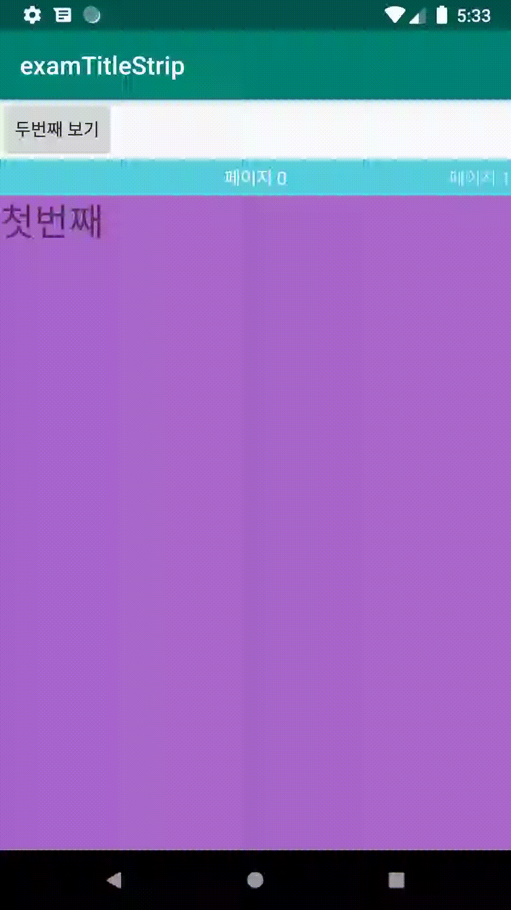

# Title Strip

**1\) activity\_main 에 ViewPager와 TitleStrip을를 추가한다.** 


```markup
<?xml version="1.0" encoding="utf-8"?>
<RelativeLayout xmlns:android="http://schemas.android.com/apk/res/android"
    android:layout_width="match_parent"
    android:layout_height="match_parent">

    <Button
        android:id="@+id/btn_change_pager"
        android:layout_width="wrap_content"
        android:layout_height="wrap_content"
        android:layout_alignParentStart="true"
        android:layout_alignParentLeft="true"
        android:layout_alignParentTop="true"
        android:text="두번째 보기" />

    <android.support.v4.view.ViewPager
        android:id="@+id/pager"
        android:layout_width="match_parent"
        android:layout_height="match_parent"
        android:layout_below="@id/btn_change_pager"
        android:layout_alignParentLeft="true">

        <android.support.v4.view.PagerTitleStrip
            android:layout_width="match_parent"
            android:layout_height="wrap_content"
            android:layout_gravity="top"
            android:background="#55cedf"
            android:textColor="#ffffff"
            android:paddingTop="5dp"
            android:paddingBottom="5dp">

        </android.support.v4.view.PagerTitleStrip>

    </android.support.v4.view.ViewPager>

</RelativeLayout>
```


**2\) 뷰 페이저에서 사용할 fragment를 생성한다. \(아래 코는 하나만 표현하였다.\)** 



```markup
<?xml version="1.0" encoding="utf-8"?>
<LinearLayout xmlns:android="http://schemas.android.com/apk/res/android"
    android:layout_width="match_parent"
    android:layout_height="match_parent"
    android:background="@android:color/holo_purple">

    <TextView
        android:layout_width="match_parent"
        android:layout_height="wrap_content"
        android:textSize="30dp"
        android:text="첫번째"/>
</LinearLayout>
```



```java
public class Fragment1 extends Fragment {
    @Nullable
    @Override
    public View onCreateView(@NonNull LayoutInflater inflater, @Nullable ViewGroup container, @Nullable Bundle savedInstanceState) {
        ViewGroup rootView = (ViewGroup) inflater.inflate(R.layout.fragment1,container,false);
        return rootView;
    }
}
```



**3\) FragmentStatePagerAdapter를 상속한 어댑터를 생성한다.**  


```java
class MoviePagerAdapter extends FragmentStatePagerAdapter{

        ArrayList<Fragment> items = new ArrayList<Fragment>();

        public MoviePagerAdapter(FragmentManager fm) {
            super(fm);
        }

        public void addItem(Fragment item){
            items.add(item);
        }

        @Override
        public Fragment getItem(int position) {
            return items.get(position);
        }

        @Override
        public int getCount() {
            return items.size();
        }
        
        @Nullable
        @Override
        public CharSequence getPageTitle(int position) {
            return "페이지 " + position;
        }
    }
```


**4\) 어댑터를 선언하고 fragment를 추가 후 뷰페이저에 적용한다.**  


```java
pager = (ViewPager) findViewById(R.id.pager);
pager.setOffscreenPageLimit(3);

MoviePagerAdapter adapter = new MoviePagerAdapter(getSupportFragmentManager());

Fragment1 fragment1 = new Fragment1();
adapter.addItem(fragment1);

Fragment2 fragment2 = new Fragment2();
adapter.addItem(fragment2);

Fragment3 fragment3 = new Fragment3();
adapter.addItem(fragment3);

pager.setAdapter(adapter);

Button btnChangePager = findViewById(R.id.btn_change_pager);
        btnChangePager.setOnClickListener(new View.OnClickListener() {
            @Override
            public void onClick(View v) {
                //pager의 두번째 페이지로 이
                pager.setCurrentItem(1);
            }
        });

```











