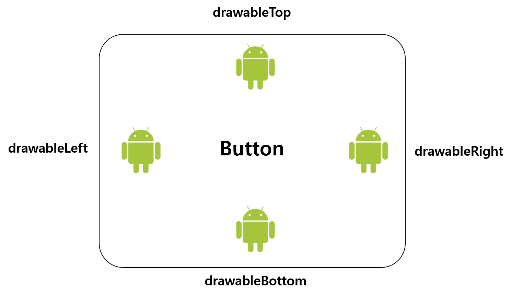

# 버튼에 이미지 넣기

Button 에 이미지를 넣는 방법을 알아보자. 

우선 xml 레이아웃파일 내에서 Button 태그의 속성들로 이미지를 넣는 방법을 알아보자. 

| Button 속성  | 설명  |
| :--- | :--- |
| background | 배경에 이미지를 넣을 때 사용  |
| src | 배경에 이미지를 넣을 때 사용 \(Button에서는 적용이 안되고 ImageButton에서만 적용\) |
| drawableTop | 버튼안의 위쪽으로 이미지를 넣을 때   |
| drawableBottom | 버튼안의 아래쪽으로 이미지를 넣을 때  |
| drawableLeft | 버튼안의 왼쪽으로 이미지를 넣을 때  |
| drawableRight | 버튼안의 오른쪽으로 이미지를 넣을 때  |


background 속성과 src 속성의 다른점은 무엇일까?

padding의 속성의 적용 유무이다.

background는 padding 값과 상관없이 배경에 이미지를 표시하지만

src는 padding 에 따라 이미지의 사이즈가 변경될 수 있다.


