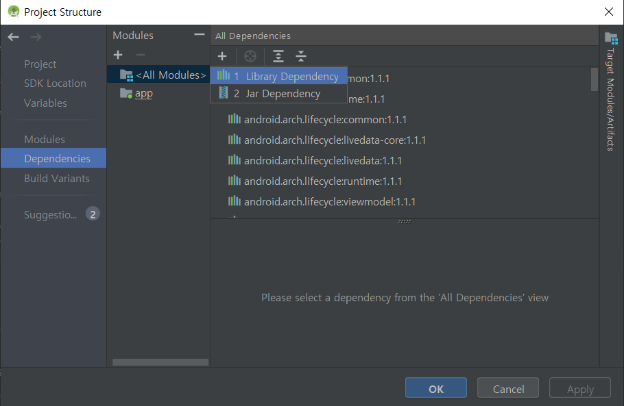
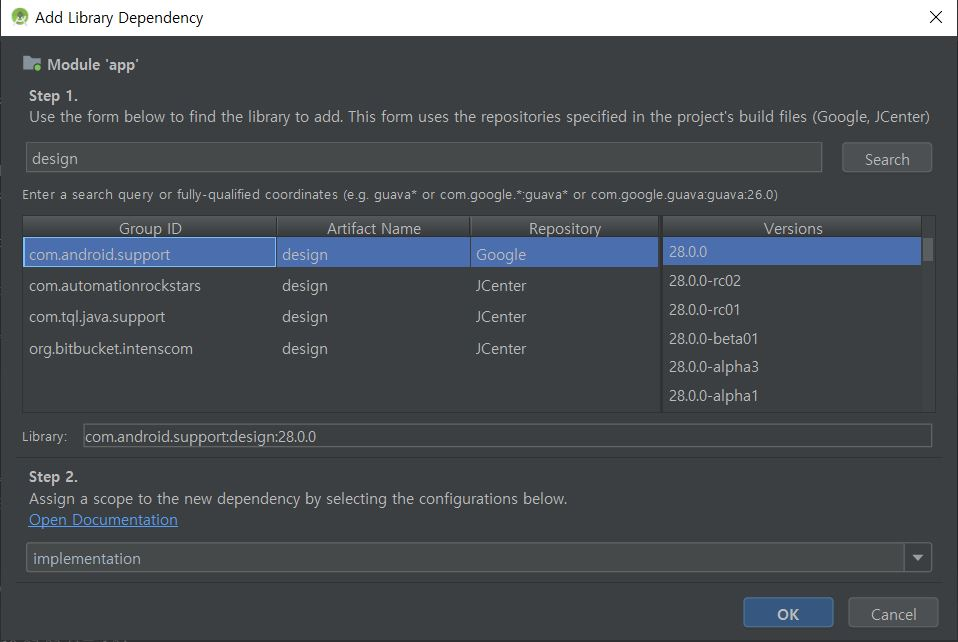

# 외부라이브러리를 참조하는 방법

**다음은 외부라이브러리 중 design 라이브러리를 참조하는 방법이다. 원하는 라이브러리가 있다면 같은방식으로 키워드를 검색하여 참조하면 된다.**

1. File -&gt; Project Structure 
2.  Dependencies -&gt; All Dependencies의 버튼을 클릭하여 Library Dependency를 선택 \(라이브러리 참조 사진 1\)
3.  design을 검색하여 com.android.support:design 을 선택한 후 ok를 클릭\(라이브러리 참조 사진 2\)

참조가 정상적으로 되었다면 build.gradle 파일에 다음과 같이 수정되어있을것이다. 



