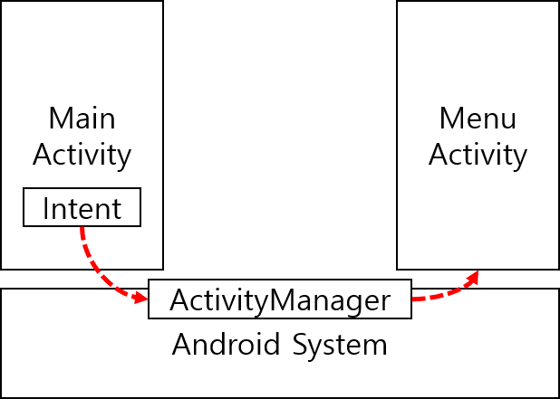
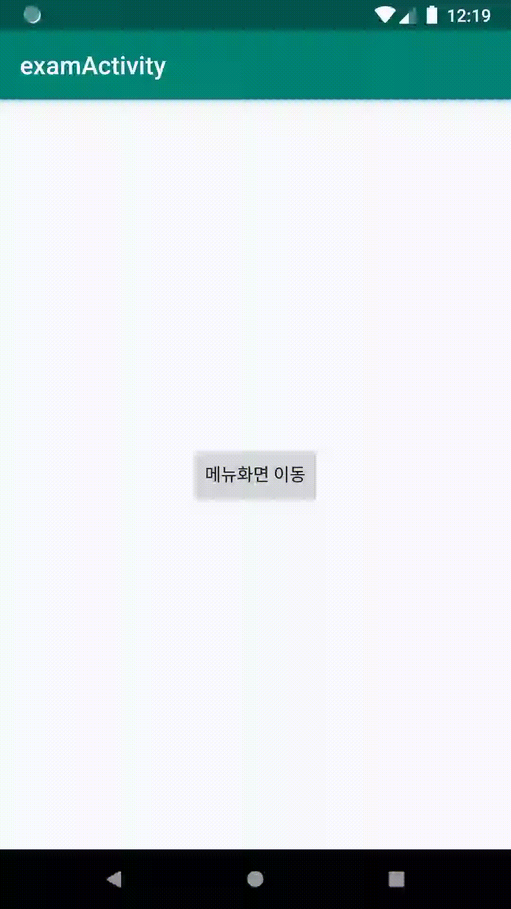

# Activity

## 안드로이드 앱을 구성하는 네가지 구성요소

* **Activity**
* **Service**
* **Broadcast Receiver**
* **Content Provider**

안드로이드 앱을 구성하는 구성요소 중에 Activity에 대해서 알아보자.

## 액티비티 생성 

1\) 새로운 앱을 생성했을때 안드로이드 시스템의 ActivityManager는 자동으로 AndroidManifest.xml 파일에 MainActivity에 대한 설정이 자동으로 다음과 같이 코드가 생성된다. 

```markup
<activity android:name=".MainActivity">
    <intent-filter>
        <action android:name="android.intent.action.MAIN" />

        <category android:name="android.intent.category.LAUNCHER" />
    </intent-filter>
</activity>
```

 `android.intent.action.MAIN` 및 `android.intent.category.LAUNCHER`가 설정된 필터는 애플리케이션을 초기화하는 항목으로 액티비티를 알린다.

2\) 추가로 액티비티를 생성한다면 Activity의 name 만 자동으로 설정이 된다.

```markup
<activity android:name=".MenuActivity"></activity>
```

## 액티비티 화면 전환 

### 1\) MainActivity -&gt; MenuActivity 로 이동


```java
Intent intent = new Intent(getApplicationContext(),MenuActivity.class);
startActivityForResult(intent,101);
```



다른액티비티로 이동만이 목적이라면 `startActivity(intent)` 로 이동이 가능하다. 하지만 응답을 받고 싶다면 `startActivityForResult(intent,101)` 처럼 코드번호를 지정하여\(1\) 액티비티를 이동한후 `OnActivityResult` 오버라이드 메소드에서 코드번호를 통해 데이터를 수신 받을 수 있다.\(3\)


### 2\) MenuActivity -&gt; MainActivity 로 데이터 전송 후 액티비티 종료 


```java
Intent intent = new Intent();
intent.putExtra("name","mike");
setResult(Activity.RESULT_OK,intent);
finish();
```


`setResult`를 사용하여 `Activity.RESULT_OK`\(확인\) 또는 `Activity.RESULT_CANCELED`\(취소\)를 설정하면 이전 액티비티로 돌아갈때 정보가 전달된다.


**액티비티를 종료하는 방법** 

일반적으로 액티비티는 스택형식으로 쌓이기 때문에 액티비티를 종료할 경우 `finish()` 메소드를 통해 액티비티가 종료되고 이전 액티비티가 나타나게 된다.


### 3\) MenuActivity로 부터 전송 데이터 MainActivity에서 수신   


```java
@Override
protected void onActivityResult(int requestCode, int resultCode, @Nullable Intent data) {
    super.onActivityResult(requestCode, resultCode, data);

    if(requestCode == 101){
       String name = data.getStringExtra("name");
       Toast.makeText(getApplicationContext(),"메뉴화면으로부터 응답 :" + name ,Toast.LENGTH_LONG).show();
    }

}
```


MenuActivity로 이동할 때 설정한 requestCode를 비교하여 응답을 받는다.

3번째 인자값 data를 통해 MenuAcitivity로부터 전달된 값을 사용할 수 있다. 


데이터 이동에 대한 자세한 정보는 다음 페이지를 참고하자.




**다시 정리를 하자면,** 



MainActivity에서는 Intent를 통해 MenuActivity를 실행할 수 있다\(액티비티스택에 쌓을 수 있다\) 

Intent는 Android System의 ActivityManager에 의해 설정한 Activity를 실행 하게 된다. 










