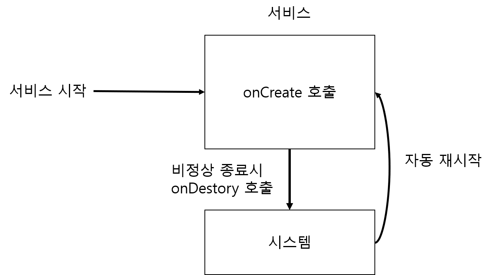

# Service

자동으로 재시작 되는 서비스 

* 서비스는 화면이 없는 상태에서 백그라운드로 실행 
* 서비스는 프로세스가 종료되어도 시스템에서 자동으로 재시작함 





```java
public class MainActivity extends AppCompatActivity {
    EditText edtData;
    @Override
    protected void onCreate(Bundle savedInstanceState) {
        super.onCreate(savedInstanceState);
        setContentView(R.layout.activity_main);

        edtData = findViewById(R.id.edt_data);

        Button btnStartService = findViewById(R.id.btn_start_service);
        btnStartService.setOnClickListener(new View.OnClickListener() {
            @Override
            public void onClick(View v) {
                String name =  edtData.getText().toString();

                Intent intent = new Intent(getApplicationContext(),MyService.class);
                intent.putExtra("command","show");
                intent.putExtra("name",name);
                if(Build.VERSION.SDK_INT >= 26 ){

                }else{
                    startService(intent);
                }

            }
        });
        Intent passedIntent = getIntent();
        processCommand(passedIntent);
    }

    private void processCommand(Intent intent) {
        if(intent != null){
            String command = intent.getStringExtra("command");
            String name = intent.getStringExtra("name");

            Toast.makeText(this,"서비스로부터 전달받은 데이터 : "+command+", "+name,Toast.LENGTH_LONG).show();

            edtData.setText(name+"1");
        }
    }

    @Override
    protected void onNewIntent(Intent intent) {
        processCommand(intent);
        super.onNewIntent(intent);
    }
}
```



```java
public class MyService extends Service {
    private static final String TAG = "MyService";

    public MyService() {
    }

    @Override
    public IBinder onBind(Intent intent) {
        // TODO: Return the communication channel to the service.
        throw new UnsupportedOperationException("Not yet implemented");
    }

    @Override
    public void onCreate() {
        super.onCreate();

        Log.d(TAG, "onCreate() 호출됨.");
    }

    @Override
    public int onStartCommand(Intent intent, int flags, int startId) {
        Log.d(TAG, "onStartCommand() 호출됨.");

        if (intent == null) {
            return Service.START_STICKY;
        } else {
            processCommand(intent);
        }
        return super.onStartCommand(intent, flags, startId);
    }

    private void processCommand(Intent intent) {
        String command = intent.getStringExtra("command");
        String name = intent.getStringExtra("name");

        Log.d(TAG, "전달받은 데이터 : " + command + ", " + name);

        try {
            Thread.sleep(5000);
        } catch (Exception e) {
        }

        Intent showIntent = new Intent(getApplicationContext(), MainActivity.class);
        showIntent.addFlags(Intent.FLAG_ACTIVITY_NEW_TASK |
                Intent.FLAG_ACTIVITY_SINGLE_TOP |
                Intent.FLAG_ACTIVITY_CLEAR_TOP);
        showIntent.putExtra("command", "show");
        showIntent.putExtra("name", name + "from service");
        startActivity(showIntent);
    }

    @Override
    public void onDestroy() {
        super.onDestroy();
        Log.d(TAG, "onDestroy() 호출됨.");
    }
}
```



서비스의 한번 실행되면 계속 남아있는 특성 때문에 intent는  onStartCommand 에서 받는다. 

서비스는 Oreo 버전 미만에서는 startService\(intent\)를 사용하여 서비스를 시작하거나 서비스에게 데이터를 전달할 때 사용한다. 

서비스가 백그라운드로 실행 중이고 앱이 종료되어있는 상태라면 서비스에서 액티비티를 띄웠을 때 아무것도 없는 상태에서 액티비티를 띄워야하기 때문에 FLAG\_ACTIVITY\_NEW\_TASK를 설정해 주어야한다. 

일반적으로 FLAG\_ACTIVITY\_NEW\_TASK 를 사용할 때에는 FLAG\_ACTIVITY\_SINGLE\_TOP, FLAG\_ACTIVITY\_CLEAR\_TOP과 같이 사용한다. 





