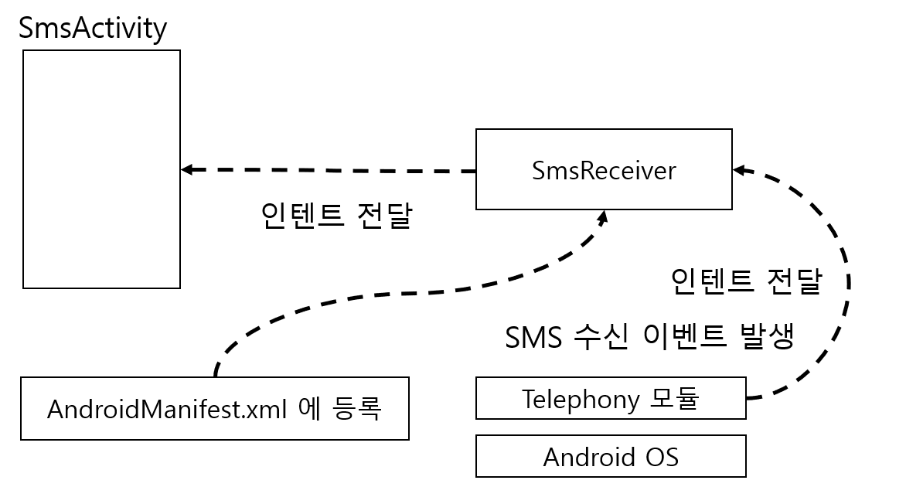
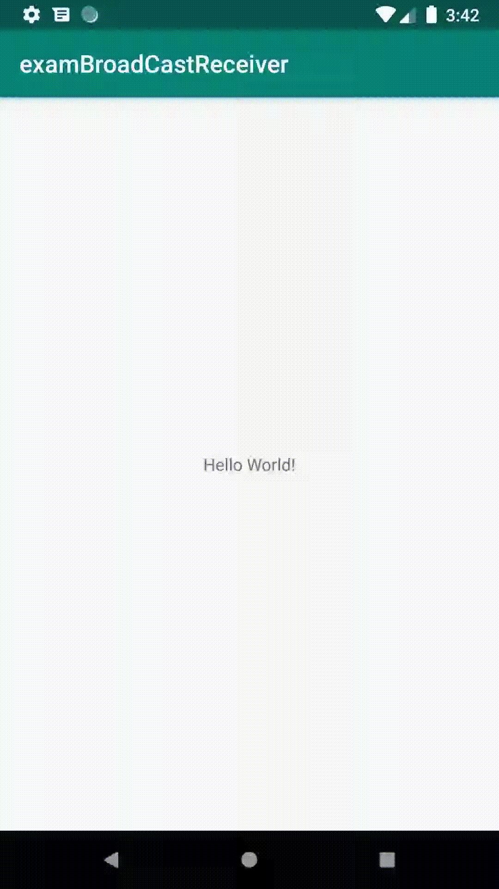

# BroadCastReceiver

## 브로드 캐스팅 이란?

**: 메세지를 여러 대상에게 전달 하는 것**

브로드 캐스트의 메세지를 받기위해서는 브로드캐스트 수신자\(BroadCastReceiver\)를 등록해야한다.

가장 대표적인 SMS를 예로 들어보자. 아래 예제에서는 커스텀 SMS Activity를 띄우도록 하였다.



### 1\) 우선 BroadCastRecevier를 생성한다.



```java
public class SmsReceiver extends BroadcastReceiver {
    private static final String TAG = "SmsReceiver";

    private  static SimpleDateFormat format = new SimpleDateFormat("yyyy-MM-dd HH:mm");

    @Override
    public void onReceive(Context context, Intent intent) {
        //if(intent.getAction() =="android.provider.Telephony.SMS_RECEIVED"){
        Log.d(TAG, "OnReceive() 호출됨");
        //}

        Bundle bundle = intent.getExtras();
        SmsMessage[] message = parseSmsMessage(bundle);
        if (message.length > 0){
            String sender = message[0].getOriginatingAddress();
            Log.d(TAG,"sender : " + sender);

            String contents = message[0].getMessageBody().toString();
            Log.d(TAG, "contents : " + contents);

            Date receiverDate = new Date(message[0].getTimestampMillis());
            Log.d(TAG,"received date : " + receiverDate);
            //smsActivity로 데이터를 보냄 
            sendToActivity(context,sender,contents,receiverDate);
        }

    }

    private void sendToActivity(Context context, String sender, String contents, Date receiverDate) {
        Intent intent = new Intent(context,SmsActivity.class);
        intent.addFlags(Intent.FLAG_ACTIVITY_NEW_TASK
                        |Intent.FLAG_ACTIVITY_SINGLE_TOP
                        |Intent.FLAG_ACTIVITY_CLEAR_TOP);
        intent.putExtra("sender",sender);
        intent.putExtra("contents",contents);
        intent.putExtra("receivedDate",format.format(receiverDate));

        context.startActivity(intent);
    }

    private SmsMessage[] parseSmsMessage(Bundle bundle) {
        Object[] objs = (Object[]) bundle.get("pdus");
        SmsMessage[] messages = new SmsMessage[objs.length];
        for (int i = 0; i < objs.length; i++) {
            if (Build.VERSION.SDK_INT >= Build.VERSION_CODES.M) {
                String format = bundle.getString("format");
                messages[i] = SmsMessage.createFromPdu((byte[]) objs[i], format);
            } else {
                messages[i] = SmsMessage.createFromPdu((byte[]) objs[i]);

            }
        }
        return messages;
    }
}

```




pdus란?

SMS를 처리하는 국제 프로토콜 


### 2\) AndroidManifest 의 intent-filter에 action을 설정한다.



```markup
<receiver
    android:name=".SmsReceiver"
    android:enabled="true">
    <intent-filter android:priority="1">
        <action android:name="android.provider.Telephony.SMS_RECEIVED" />
    </intent-filter>
</receiver>
```



### 3\) AndroidManifest SMS 권한을 설정한다. 

```markup
<uses-permission android:name="android.permission.RECEIVE_SMS" />
```

### 4\) SMS Activity를 생성한다.

```java
public class SmsActivity extends AppCompatActivity {

    EditText edtSender;
    EditText edtContents;
    EditText edtReceivedDate;
    @Override
    protected void onCreate(Bundle savedInstanceState) {
        super.onCreate(savedInstanceState);
        setContentView(R.layout.activity_sms);

        edtSender = findViewById(R.id.edt_sender);
        edtContents = findViewById(R.id.edt_contents);
        edtReceivedDate = findViewById(R.id.edt_receiving_time);

        Button btnSend = findViewById(R.id.btn_send);

        btnSend.setOnClickListener(new View.OnClickListener() {
            @Override
            public void onClick(View v) {
                finish();
            }
        });

        Intent passedIntent = getIntent();
        processCommand(passedIntent);
    }

    @Override
    protected void onNewIntent(Intent intent) {
        super.onNewIntent(intent);
    }

    private void processCommand(Intent intent) {
        if(intent != null){
            String sender = intent.getStringExtra("sender");
            String contents = intent.getStringExtra("contents");
            String receivedDate = intent.getStringExtra("receivedDate");

            edtSender.setText(sender);
            edtContents.setText(contents);
            edtReceivedDate.setText(receivedDate);
        }
    }
}
```






