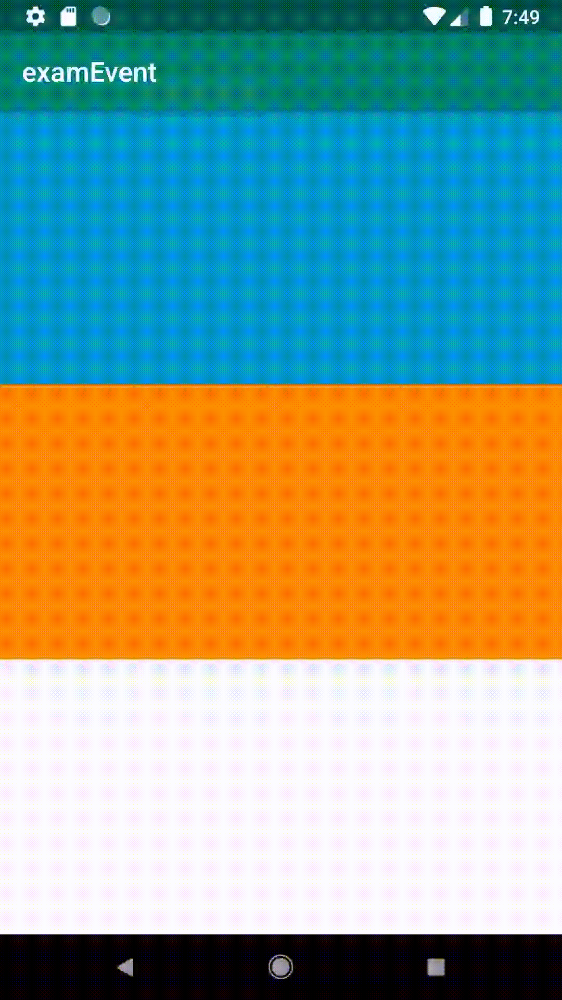
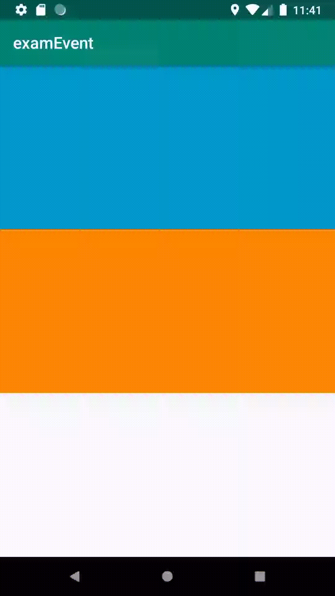
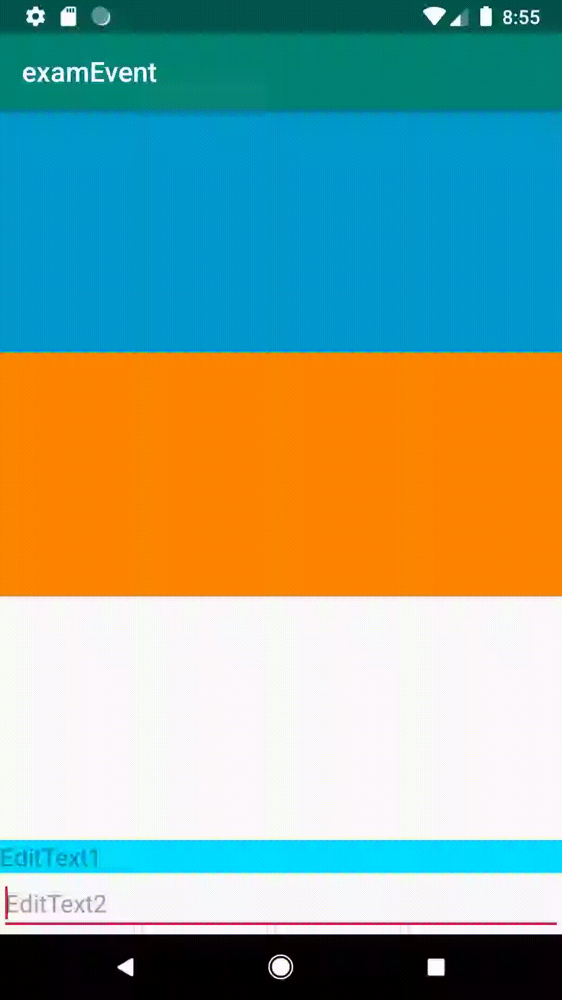
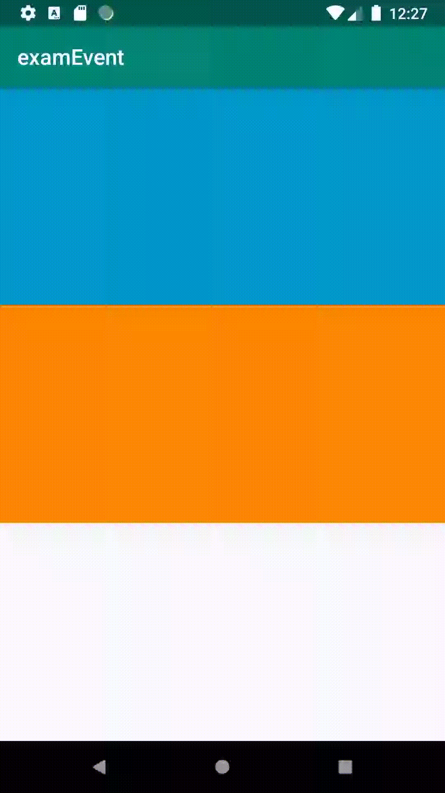

# Event

## 대표적인 이벤트 

* Touch : 화면 터치
* Key : 키 패드 또는 하드웨어 버튼 
* Gesture : 터치이벤트의 일정 패턴
* Focus : 뷰가 포커스를 받거나 잃거나 할때
* Screen Orientation : 화면 방향 변경



첫번째로 Touch  이벤트에 대해서 알아보자.

다음 예제는 View의 범위내에 터치이벤트의 동작\(Down,Move,Up\)및 좌표를 확인할 수 있다.  

```java
View view = findViewById(R.id.view1);
view.setOnTouchListener(new View.OnTouchListener() {
    @Override
    public boolean onTouch(View v, MotionEvent event) {
        int action = event.getAction();
        float curX = event.getX();
        float curY = event.getY();
        if(action == MotionEvent.ACTION_DOWN){
            println("눌름 "+ curX +" , "+ curY);
        }
        else if(action == MotionEvent.ACTION_MOVE){
            println("움직임 "+ curX +" , "+ curY);
        }
        else if(action == MotionEvent.ACTION_UP){
            println("떼었음 "+ curX +" , "+ curY);
        }
        //스크롤뷰의 맨 아래으로 포커스를 맞춤 
        scrollView.fullScroll(ScrollView.FOCUS_DOWN);
        return true;
    }
});
void println(String str){
    textView.append(str+"\n");
}
```





### 키를 눌렀을때 전달되는 대표적인 키값

| **키 코드** | **설명** |
| :--- | :--- |
| KEYCODE\_DPAD\_LEFT | 왼쪽 화살표 |
| KEYCODE\_DPAD\_RIGHT | 오른쪽 화살표 |
| KEYCODE\_DPAD\_UP | 위쪽 화살표 |
| KEYCODE\_DPAD\_DOWN | 아래쪽 화살표 |
| KEYCODE\_DPAD\_CENTER | \[중앙\] 버튼 |
| KEYCODE\_CALL | \[통화\] 버튼 |
| KEYCODE\_ENDCALL | \[통화 종료\] 버튼 |
| KEYCODE\_HOME | \[홈\] 버튼 |
| KEYCODE\_BACK | \[뒤로가기\] 버튼 |
| KEYCODE\_VOLUME\_UP | \[소리 크기 증가\] 버튼 |
| KEYCODE\_VOLUME\_DOWN | \[소리 크기 감소\] 버튼 |
| KEYCODE\_0 ~ KEYCODE\_9 | 숫자 0부터 9까지의 키값 |
| KEYCODE\_A ~ KEYCODE\_Z | 알파벳 A부터 Z까지의 키 |

뷰를 상속할 때 키 이벤트 처리를 위한 메소드 재정의

```java
boolean onKeyDown(int keyCode, KeyEvent event)
boolean onKey(View v, int keyCode, KeyEvent event)
```

#### 시스템 Back 버튼 클릭시 동작 제

```java
@Override
public boolean onKeyDown(int keyCode, KeyEvent event) {
    if(keyCode == KeyEvent.KEYCODE_BACK){
        Toast.makeText(this,"시스템 Back 버튼 눌림.",Toast.LENGTH_LONG).show();
        return true;
    }
    return false;
}
```





Touch 이벤트로 제어가 어려운것들은 Gesture 이벤트를 통해 제어가 가능하다.

다음은 Gesture 이벤트로 제어가능한 메소드들이다. 

| **메소드** | **이벤트 유형** |
| :--- | :--- |
| onDown\(\) | 화면이 눌렸을 경우 |
| onShowPress\(\) | 화면이 눌렸다 떼어지는 경우 |
| onSingleTapUp\(\) | 화면이 한 손가락으로 눌렸다 떼어지는 경우 |
| onSingleTapConfirmed\(\) | 화면이 한 손가락으로 눌려지는 경우 |
| onDoubleTap | 화면이 두 손가락으로 눌려지는 경우 |
| onDoubleTapEvent\(\) | 화면이 두 손가락으로 눌려진 상태에서 떼거나 이동하는 등 세부적인 액션을 취하는 경우 |
| onScroll\(\) | 화면이 눌린 채 일정한 속도와 방향으로 움직였다 떼는 경우 |
| onFling\(\) | 화면이 눌린 채 가속도를 붙여 손가락을 움직였다 떼는 경우 |
| onLongPress\(\) | 화면을 손가락으로 오래 누르는 경 |

```java
GestureDetector gestureDetector;
@Override
protected void onCreate(Bundle savedInstanceState) {
    super.onCreate(savedInstanceState);
    setContentView(R.layout.activity_main);
    
    gestureDetector = new GestureDetector(this, new GestureDetector.OnGestureListener() {    @Override
        public boolean onDown(MotionEvent e) {
            println("onDown 호출됨.");
            return true;
        }

        @Override
        public void onShowPress(MotionEvent e) {
            println("onShowPress 호출됨.");
        }

        @Override
        public boolean onSingleTapUp(MotionEvent e) {
            println("onShowPress 호출됨.");
            return true;
        }

        @Override
        public boolean onScroll(MotionEvent e1, MotionEvent e2, float distanceX, float distanceY) {
            println("onScroll 호출됨. "+ distanceX + ", "+distanceY);
            return true;
        }

        @Override
        public void onLongPress(MotionEvent e) {
            println("onLongPress 호출됨.");

        }

        @Override
        public boolean onFling(MotionEvent e1, MotionEvent e2, float velocityX, float velocityY) {
            println("onFling 호출됨. "+ velocityX + ", "+velocityY);
            return true;
        }
    });
    View view2 = findViewById(R.id.view2);
    view2.setOnTouchListener(new View.OnTouchListener() {
        @Override
        public boolean onTouch(View v, MotionEvent event) {
            gestureDetector.onTouchEvent(event);
            return true;
        }
    });
}
```





Focus 이벤트를 확인하기위해 EditText를 사용함.  예제에서는 EditText1의 background에 상태드로어블을 사용하여 Focus 일 경우 white, UnFocus 일 경우 holo\_blue\_bright 내었음. 



```markup
<EditText
    android:layout_width="match_parent"
    android:layout_height="wrap_content"
    android:hint="EditText1"
    android:background="@drawable/selector1"/>
<EditText
    android:layout_width="match_parent"
    android:layout_height="wrap_content"
    android:hint="EditText2"
    />
```





```markup
<?xml version="1.0" encoding="utf-8"?>
<selector xmlns:android="http://schemas.android.com/apk/res/android">
    <item
        android:state_focused="true"
        android:drawable="@android:color/white"/>
    <item
        android:state_focused="false"
        android:drawable="@android:color/holo_blue_bright"/>
</selector>
```







### 화면전환 설정 

| 설정  | 화면 모드  |
| :--- | :--- |
| ORIENTATION\_LANDSCAPE | 화면 가로모드 |
| ORIENTATION\_PORTRAIT | 화면 세로모드  |

MainActivity.java 에 onConfiguationChanged를 재정의.



```java
@Override
public void onConfigurationChanged(Configuration newConfig) {
    super.onConfigurationChanged(newConfig);

    // Checks the orientation of the screen
    if (newConfig.orientation == Configuration.ORIENTATION_LANDSCAPE) {
        Toast.makeText(this, "landscape", Toast.LENGTH_SHORT).show();
    } else if (newConfig.orientation == Configuration.ORIENTATION_PORTRAIT){
        Toast.makeText(this, "portrait", Toast.LENGTH_SHORT).show();
    }
}
```



  
AndroidManifest.xml의 .MainActivity에 해당하는 activity의 configChanges 속성값을 설정



```text
<activity android:name=".MainActivity"
          android:configChanges="orientation|keyboardHidden">
```












