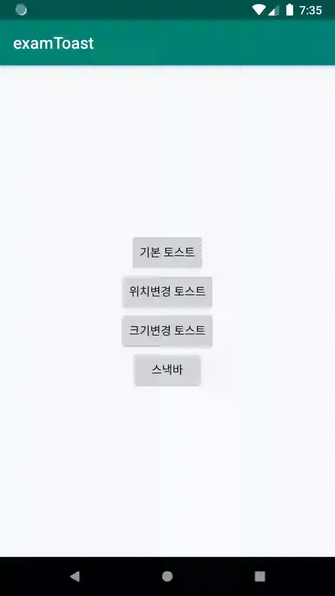

# Toast

Toast : 간단한 메세지를 잠깐 보여주었다가 없어지는 메세

Toast는 기본적인 형태로 텍스트만 띄울 수 있지만,  setGravity\(\) 메소드를 통해 위치 변경, setView\(\) 메소드를 통해 뷰의 형태를 변경하여 사용할 수도 있다.

**기본 토스트**

```java
Toast.makeText(getApplicationContext(),"기본토스트",Toast.LENGTH_LONG).show();
```

**위치 변경 토스트**

```java
Toast toast = Toast.makeText(getApplicationContext(),"위치변경 토스트",Toast.LENGTH_LONG);
toast.setGravity(Gravity.TOP|Gravity.LEFT,200,200); //위치변경: 기준점(TOP,LEFT)을 기준으로 200,200에 해당하는 좌표로 지
toast.show();
```

**모양 변경 토스트**



```java
LayoutInflater inflater = getLayoutInflater();
View layout = inflater.inflate(R.layout.toastborder,(ViewGroup)findViewById(R.id.toast_layout_root));
TextView text = (TextView) layout.findViewById(R.id.text);
text.setText("모양 변경 토스트");
Toast toast = new Toast(getApplicationContext());
toast.setGravity(Gravity.CENTER,0,-100);//토스트 위치
toast.setDuration(Toast.LENGTH_LONG);//토스트 시간
toast.setView(layout);//inflater로 설정된 layout를 toast의 View로 설정 
toast.show();
```



```markup
<?xml version="1.0" encoding="utf-8"?>
<LinearLayout
    xmlns:android="http://schemas.android.com/apk/res/android"
    android:orientation="horizontal"
    android:layout_width="match_parent"
    android:layout_height="match_parent"
    android:id="@+id/toast_layout_root">
    <TextView
        android:id="@+id/text"
        android:layout_width="wrap_content"
        android:layout_height="wrap_content"
        android:padding="20dp"
        android:textSize="40dp"
        android:background="@drawable/toast"
        />
</LinearLayout>

```



```markup
<?xml version="1.0" encoding="utf-8"?>
<shape xmlns:android="http://schemas.android.com/apk/res/android"
    android:shape="rectangle">

    <stroke
        android:width="4dp"
        android:color="#ff00ffff"/>
    <solid
        android:color="#ff0000ff"/>
    <padding
        android:left="10dp"
        android:top="10dp"
        android:right="10dp"
        android:bottom="10dp"/>
    <corners
        android:radius="15dp"/>

</shape>

```



**스낵바** 


스낵바를 사용하기 위해서는 외부 라이브러리를 참조해야함 




```text
Snackbar.make(v,"스낵바 테스트",Snackbar.LENGTH_LONG).show();
```






