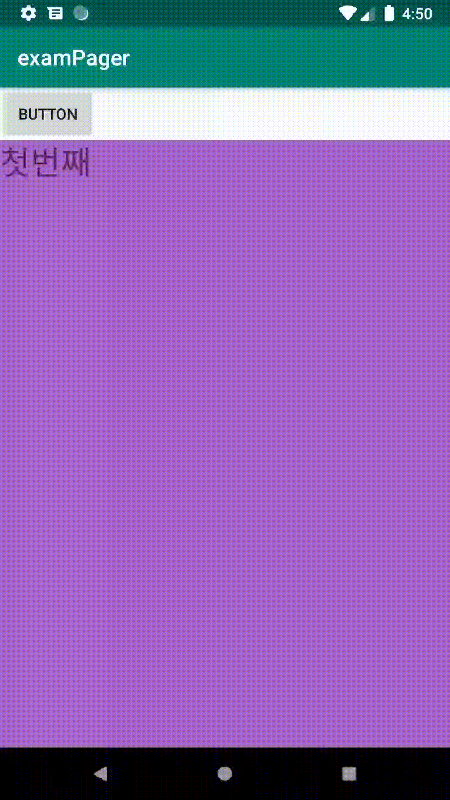

# View Pager

### 뷰 페이저 만들기

**1\) activity\_main 에 ViewPager를 추가한다.** 


```markup
<android.support.v4.view.ViewPager
    android:id="@+id/pager"
    android:layout_width="match_parent"
    android:layout_height="match_parent"
    android:layout_below="@id/btn_change_pager"
    android:layout_alignParentLeft="true">

</android.support.v4.view.ViewPager>
```


**2\) 뷰 페이저에서 사용할 fragment를 생성한다. \(아래 코는 하나만 표현하였다.\)** 



```markup
<?xml version="1.0" encoding="utf-8"?>
<LinearLayout xmlns:android="http://schemas.android.com/apk/res/android"
    android:layout_width="match_parent"
    android:layout_height="match_parent"
    android:background="@android:color/holo_purple">

    <TextView
        android:layout_width="match_parent"
        android:layout_height="wrap_content"
        android:textSize="30dp"
        android:text="첫번째"/>
</LinearLayout>
```



```java
public class Fragment1 extends Fragment {
    @Nullable
    @Override
    public View onCreateView(@NonNull LayoutInflater inflater, @Nullable ViewGroup container, @Nullable Bundle savedInstanceState) {
        ViewGroup rootView = (ViewGroup) inflater.inflate(R.layout.fragment1,container,false);
        return rootView;
    }
}
```



**3\) FragmentStatePagerAdapter를 상속한 어댑터를 생성한다.**  


```java
class MoviePagerAdapter extends FragmentStatePagerAdapter{

        ArrayList<Fragment> items = new ArrayList<Fragment>();

        public MoviePagerAdapter(FragmentManager fm) {
            super(fm);
        }

        public void addItem(Fragment item){
            items.add(item);
        }

        @Override
        public Fragment getItem(int position) {
            return items.get(position);
        }

        @Override
        public int getCount() {
            return items.size();
        }
    }
```


**4\) 어댑터를 선언하고 fragment를 추가 후 뷰페이저에 적용한다.**  


```java
ViewPager pager = (ViewPager) findViewById(R.id.pager);
pager.setOffscreenPageLimit(3);

MoviePagerAdapter adapter = new MoviePagerAdapter(getSupportFragmentManager());

Fragment1 fragment1 = new Fragment1();
adapter.addItem(fragment1);

Fragment2 fragment2 = new Fragment2();
adapter.addItem(fragment2);

Fragment3 fragment3 = new Fragment3();
adapter.addItem(fragment3);

pager.setAdapter(adapter);
```



`setOffscreenPageLimit` 는 미리 몇개를 그려놓을지 지정하는 것이다. 












