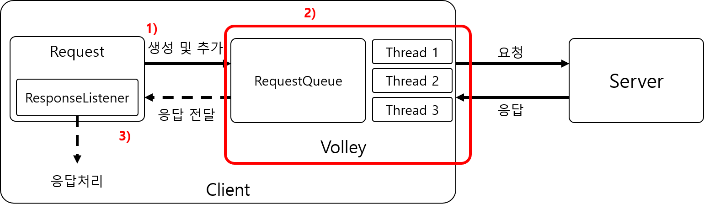

# Volley

## Volley

#### Volley 라이브러리는 웹 요청과 응답을 단순화시키기 위해 만들어진 라이브러리들 중의 하나 



#### 1\) StringRequest로 Request 생성 및 추가\(add\)

#### 2\) Volley \( RequestQueue , Thread\) 작업 수행 

* 네트워킹은 스레드가 필요하므로 스레드를 생성해서 요청 및 응답 작업을 담당
* 네트워크 요청\(Request\) 우선 순위 자동으로 관리
* 동시에 여러 네트워크 요청 가능 
* 메인스레드에서 UI에 접근할 수 있도록 하는 과정까지 수행

#### 3\) 미리등록한 ResponseListener는 RequestQueue로부터 응답을 전달받고 처리함

## Volley 사용

### 1\) build.gradle 에 라이브러리 등록 


```text
dependencies {
    ...
    implementation 'com.android.volley:volley:1.1.0'
}
```


### 2\) INTERNET 권한 설정 


```markup
<uses-permission android:name="android.permission.INTERNET" />
```


### 3\) static 사용 변수 선언\(RequestQueue, request 관련정보\)


```java
public class AppHelper {
    public static RequestQueue requestQueue;
    public static String host = "boostcourse-appapi.connect.or.kr";
    public static int port = 10000;
}
```


### 4\) requestQueue 선언 


```java
if(AppHelper.requestQueue == null){
       AppHelper.requestQueue = Volley.newRequestQueue(getApplicationContext());
}
```


### 5\) StringRequest를 사용한 request 생성 및 추가 

StringRequest 는 다음과 같은 정보를 통해 request를 생성한다. 

* 요청방식\(POST, GET\)
* url 
* 응답처리
* 에러처리

#### **GET**


```java
public void sendRequest() {
        String url = "http://www.google.co.kr";
        StringRequest request = new StringRequest(
                Request.Method.GET,
                url,
                new Response.Listener<String>() {
                    @Override
                    public void onResponse(String response) {
                        println("응답 -> " + response);
                    }
                },
                new Response.ErrorListener() {
                    @Override
                    public void onErrorResponse(VolleyError error) {
                        println("에러 -> " + error);
                    }
                }
        ){
            @Override
            protected Map<String, String> getParams() throws AuthFailureError {
                Map<String, String> params = new HashMap<String, String>();

                return params;
            }
        };
        //캐시에 이전결과가 있더라도 새롭게 재 요청하도록 설정  
        request.setShouldCache(false);
        //requestQueue에 request추가
        AppHelper.requestQueue.add(request);
    }
```


#### POST 

`POST`도 `GET`과 동일한방식으로 Request를 생성하며 다른점은 요청 시 보낼 데이터에 대한 설정이다.

 `getParams`에서 `put`메소드를 사용하여 데이터를 저장한 후 `params`를 리턴하여 서버에 데이터가 적용된다.


```java
private void requestWriteComment() {
        String url = "http://" + AppHelper.host + ":" + AppHelper.port + "/movie/createComment";
        url += "?" + "id=3";
        StringRequest request = new StringRequest(
                Request.Method.POST,
                url,
                new Response.Listener<String>() {
                    @Override
                    public void onResponse(String response) {
                        println("응답 받음 -> " + response);
                    }
                },
                new Response.ErrorListener() {
                    @Override
                    public void onErrorResponse(VolleyError error) {
                        println("에러 발생 -> " + error.getMessage());
                    }
                }
        ) {
            @Override
            protected Map<String, String> getParams() throws AuthFailureError {
                Map<String, String> params = new HashMap<>();
                params.put("writer", "A");
                params.put("rating", "4.5");
                params.put("contents", "재밌어요");
                return params;
            }
        };

        request.setShouldCache(false);
        AppHelper.requestQueue.add(request);
    }
```


POST Request를 요청하였다면 [영화한줄평리스트](http://boostcourse-appapi.connect.or.kr:10000/movie/readCommentList?id=3) 에서 업데이트 결과를 확인할 수 있다.


`setShouldCache()`는 캐시에 이전결과가 있더라도 

그대로 사용할지\(true\) 새롭게 재 요청할지\(false\)에 대한 설정이다.







